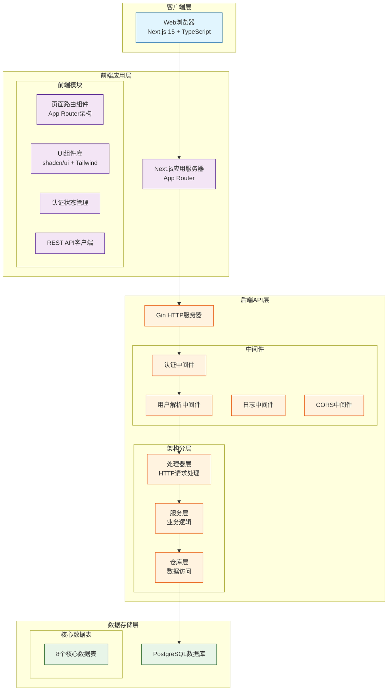
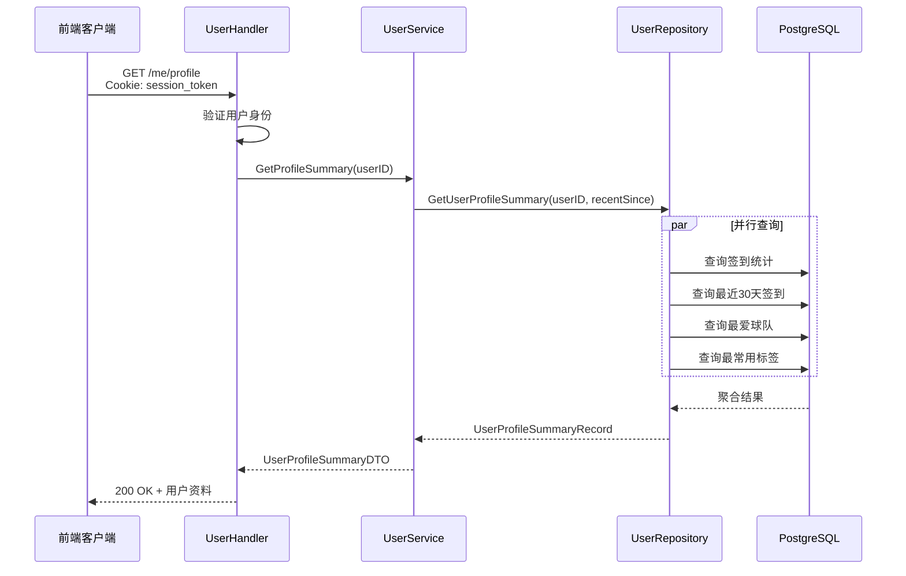

# Final Whistle 系统架构文档

## 项目概述

**Final Whistle** 是一个为足球观众设计的赛后记录产品，帮助用户记录观看的比赛、表达对比赛、球队和球员的评分感受，并建立个人足球观看档案。

**核心价值**: 帮助用户记录"这场比赛对你意味着什么"而非"告诉你比赛中发生了什么"

**V1 范围**: 完成一个完整的闭环流程：`登录 → 浏览比赛 → 比赛详情 → 创建/编辑签到 → 查看聚合数据 → 查看个人资料`

---

## 系统架构总览



---

## 1. 前端架构 (Next.js 15)

### 1.1 技术栈
- **框架**: Next.js 15 + App Router
- **语言**: TypeScript 5.0+
- **样式**: Tailwind CSS + shadcn/ui 组件库
- **状态管理**: React Context + useState/useEffect
- **表单处理**: React Hook Form + Zod 验证
- **HTTP客户端**: Fetch API + 自定义封装
- **测试**: Vitest + Playwright (E2E)

### 1.2 目录结构
```
frontend/
├── src/
│   ├── app/                    # App Router 页面
│   │   ├── page.tsx           # 首页
│   │   ├── login/
│   │   │   └── page.tsx       # 登录页
│   │   ├── matches/
│   │   │   ├── page.tsx       # 比赛列表页
│   │   │   └── [matchId]/
│   │   │       └── page.tsx   # 比赛详情页
│   │   ├── me/
│   │   │   └── page.tsx       # 个人资料页
│   │   ├── teams/
│   │   │   └── [teamId]/
│   │   │       └── page.tsx   # 球队详情页
│   │   └── players/
│   │       └── [playerId]/
│   │           └── page.tsx   # 球员详情页
│   ├── components/            # 可复用组件
│   │   ├── auth/             # 认证相关组件
│   │   ├── checkin/          # 签到相关组件
│   │   ├── profile/          # 资料相关组件
│   │   ├── layout/           # 布局组件
│   │   └── ui/               # 基础UI组件
│   ├── lib/                  # 工具库
│   │   ├── api/              # API客户端
│   │   │   └── client.ts     # 统一API封装
│   │   ├── validations/      # 表单验证
│   │   └── utils/            # 工具函数
│   └── types/                # TypeScript类型定义
│       └── api.ts            # API响应类型
```

### 1.3 核心组件
| 组件 | 职责 | 关键技术 |
|------|------|----------|
| **AuthProvider** | 全局认证状态管理 | React Context, useEffect |
| **MatchCheckInPanel** | 比赛签到表单 | React Hook Form, 复杂表单状态 |
| **profilePageUtils** | 个人资料数据格式化 | 工具函数, 数据转换 |
| **Navigation** | 全局导航 | Next.js Link, 响应式设计 |
| **API Client** | HTTP请求封装 | Fetch API, 错误处理, 认证头 |

### 1.4 页面状态管理
```typescript
// 典型页面状态模式
export default function MePage() {
  const { status, user } = useAuth(); // 认证状态
  const [profile, setProfile] = useState<UserProfileSummary | null>(null);
  const [history, setHistory] = useState<UserCheckInHistoryResponse | null>(null);
  const [loading, setLoading] = useState(false);
  const [error, setError] = useState<string | null>(null);
  // 状态切换: loading → success/error → data
}
```

---

## 2. 后端架构 (Go Gin)

### 2.1 技术栈
- **语言**: Go 1.21+
- **Web框架**: Gin Gonic
- **ORM**: GORM (PostgreSQL驱动)
- **验证**: go-playground/validator
- **配置管理**: Viper + 环境变量
- **测试**: go test + httptest

### 2.2 Clean Architecture 分层设计

#### 2.2.1 处理器层 (Handler)
```go
// 职责: HTTP请求处理, 参数验证, 响应格式化
type UserHandler struct {
    service service.UserService
}

func (h *UserHandler) GetProfile(c *gin.Context) {
    // 1. 从中间件获取当前用户
    user, ok := middleware.CurrentUser(c)

    // 2. 调用服务层
    result, err := h.service.GetProfileSummary(user.ID)

    // 3. 格式化响应
    utils.OKResponse(c, result)
}
```

#### 2.2.2 服务层 (Service)
```go
// 职责: 业务逻辑, 事务管理, 数据验证
type userService struct {
    repo repository.UserRepository
    now  func() time.Time
}

func (s *userService) GetProfileSummary(userID uint) (*dto.UserProfileSummaryDTO, error) {
    // 1. 调用仓库层获取数据
    record, err := s.repo.GetUserProfileSummary(userID, s.now().AddDate(0, 0, -30))

    // 2. 业务逻辑处理
    if errors.Is(err, gorm.ErrRecordNotFound) {
        return nil, ErrNotFound
    }

    // 3. 数据转换
    result := &dto.UserProfileSummaryDTO{
        User: dto.UserSummaryDTO{...},
        CheckInCount: int(record.CheckInCount),
        // ... 其他字段
    }

    return result, nil
}
```

#### 2.2.3 仓库层 (Repository)
```go
// 职责: 数据访问, 数据库查询, 事务管理
type GormUserRepository struct {
    *BaseRepository
}

func (r *GormUserRepository) GetUserProfileSummary(userID uint, recentSince time.Time) (*UserProfileSummaryRecord, error) {
    // 复杂聚合查询
    var aggregate struct {
        CheckInCount   int64
        AvgMatchRating *float64
    }

    if err := r.DB.
        Model(&model.CheckIn{}).
        Select("COUNT(*) AS check_in_count, AVG(match_rating) AS avg_match_rating").
        Where("user_id = ?", userID).
        Scan(&aggregate).Error; err != nil {
        return nil, err
    }

    // ... 其他查询
}
```

#### 2.2.4 数据传输对象 (DTO)
```go
// 职责: API响应格式定义
type UserProfileSummaryDTO struct {
    User               UserSummaryDTO  `json:"user"`
    CheckInCount       int             `json:"checkInCount"`
    AvgMatchRating     *float64        `json:"avgMatchRating,omitempty"`
    FavoriteTeamID     *uint           `json:"favoriteTeamId,omitempty"`
    FavoriteTeam       *TeamSummaryDTO `json:"favoriteTeam,omitempty"`
    MostUsedTagID      *uint           `json:"mostUsedTagId,omitempty"`
    MostUsedTag        *TagDTO         `json:"mostUsedTag,omitempty"`
    RecentCheckInCount int             `json:"recentCheckInCount"`
}
```

#### 2.2.5 数据模型 (Model)
```go
// 职责: 数据库表结构映射
type CheckIn struct {
    ID              uint          `gorm:"primaryKey"`
    UserID          uint          `gorm:"not null;index"`
    MatchID         uint          `gorm:"not null;index"`
    WatchedType     WatchedType   `gorm:"size:20;not null"`
    SupporterSide   SupporterSide `gorm:"size:20;not null"`
    MatchRating     int           `gorm:"not null;check:match_rating BETWEEN 1 AND 10"`
    HomeTeamRating  int           `gorm:"not null;check:home_team_rating BETWEEN 1 AND 10"`
    AwayTeamRating  int           `gorm:"not null;check:away_team_rating BETWEEN 1 AND 10"`
    ShortReview     *string       `gorm:"size:280"`
    WatchedAt       time.Time     `gorm:"not null"`
    CreatedAt       time.Time     `gorm:"autoCreateTime;index"`
    UpdatedAt       time.Time     `gorm:"autoUpdateTime"`

    // 关联关系
    User          User           `gorm:"foreignKey:UserID"`
    Match         Match          `gorm:"foreignKey:MatchID"`
    PlayerRatings []PlayerRating `gorm:"foreignKey:CheckInID"`
    Tags          []Tag          `gorm:"many2many:checkin_tags"`
}
```

### 2.3 中间件系统
| 中间件 | 功能 | 执行顺序 |
|--------|------|----------|
| **RequestLogger** | 请求日志记录 | 1 |
| **ErrorRecovery** | 错误恢复和格式化 | 2 |
| **CORS** | 跨域资源共享 | 3 |
| **ResolveCurrentUser** | 解析当前用户(全局) | 4 |
| **RequireAuth** | 认证要求检查(路由级) | 5 |

```go
// 中间件链配置
router := gin.New()
router.Use(middleware.RequestLogger())
router.Use(middleware.ErrorRecovery())
router.Use(middleware.CORS())
router.Use(middleware.ResolveCurrentUser(authService))

// 受保护路由组
protected := router.Group("")
protected.Use(middleware.RequireAuth())
protected.GET("/me/profile", userHandler.GetProfile)
protected.GET("/me/checkins", userHandler.GetCheckInHistory)
```

---

## 3. 数据层架构

### 3.1 PostgreSQL 数据库设计

```mermaid
erDiagram
    users ||--o{ check_ins : "1:N"
    matches ||--o{ check_ins : "1:N"
    check_ins ||--o{ player_ratings : "1:N"
    check_ins }o--o{ tags : "N:M"
    matches }o--o{ players : "N:M"
    players ||--o| teams : "N:1"
    users ||--o{ sessions : "1:N"

    users {
        uint id PK
        string email UK
        string name
        string avatar_url
        timestamp created_at
        timestamp updated_at
    }

    matches {
        uint id PK
        string competition
        string season
        string round
        string status
        timestamp kickoff_at
        uint home_team_id FK
        uint away_team_id FK
        int home_score
        int away_score
    }

    check_ins {
        uint id PK
        uint user_id FK "索引"
        uint match_id FK "索引"
        string watched_type
        string supporter_side
        int match_rating "1-10"
        int home_team_rating "1-10"
        int away_team_rating "1-10"
        text short_review "<=280"
        timestamp watched_at
        timestamp created_at "索引"
        timestamp updated_at
    }

    player_ratings {
        uint id PK
        uint check_in_id FK
        uint player_id FK
        int rating "1-10"
        text note "<=80"
    }

    tags {
        uint id PK
        string name
        string slug UK
        int sort_order
        bool is_active
    }

    checkin_tags {
        uint check_in_id FK
        uint tag_id FK
        primary_key (check_in_id, tag_id)
    }

    sessions {
        uint id PK
        uint user_id FK
        string token UK
        timestamp expired_at "索引"
        timestamp created_at
    }
```

### 3.2 关键索引设计
| 表 | 索引 | 类型 | 用途 |
|-----|------|------|------|
| **check_ins** | `(user_id, match_id)` | 唯一索引 | 确保用户每场比赛只有一个签到 |
| **check_ins** | `user_id` | 普通索引 | 用户签到查询 |
| **check_ins** | `created_at` | 普通索引 | 时间范围查询 |
| **sessions** | `token` | 唯一索引 | 会话令牌查找 |
| **sessions** | `expired_at` | 普通索引 | 过期会话清理 |

### 3.3 数据约束
- **唯一约束**: `check_ins(user_id, match_id)` - 每用户每比赛唯一签到
- **检查约束**: 所有评分字段 1-10 范围
- **外键约束**: 所有关联关系保持数据完整性
- **非空约束**: 关键字段不允许为空

---

## 4. API 设计

### 4.1 API 响应格式

#### 成功响应
```json
{
  "success": true,
  "data": {
    // 业务数据
  }
}
```

#### 错误响应
```json
{
  "success": false,
  "error": {
    "code": "VALIDATION_ERROR",
    "message": "invalid request body",
    "details": {
      "field": "matchRating",
      "reason": "must be between 1 and 10"
    }
  }
}
```

### 4.2 错误代码定义
| 错误码 | HTTP状态码 | 描述 |
|--------|------------|------|
| `VALIDATION_ERROR` | 400 | 请求参数验证失败 |
| `UNAUTHORIZED` | 401 | 未认证或认证无效 |
| `FORBIDDEN` | 403 | 权限不足 |
| `NOT_FOUND` | 404 | 资源不存在 |
| `CONFLICT` | 409 | 资源冲突（如重复签到） |
| `INTERNAL_ERROR` | 500 | 服务器内部错误 |

### 4.3 核心API端点

#### 4.3.1 认证API
| 方法 | 端点 | 认证 | 描述 |
|------|------|------|------|
| `POST` | `/auth/login` | 否 | 开发登录（邮箱+姓名） |
| `POST` | `/auth/logout` | 是 | 登出当前会话 |
| `GET` | `/auth/me` | 是 | 获取当前用户信息 |

#### 4.3.2 公共API
| 方法 | 端点 | 认证 | 描述 |
|------|------|------|------|
| `GET` | `/matches` | 否 | 比赛列表（支持筛选） |
| `GET` | `/matches/:id` | 否 | 比赛详情（含聚合数据） |
| `GET` | `/teams/:id` | 否 | 球队详情 |
| `GET` | `/players/:id` | 否 | 球员详情 |

#### 4.3.3 受保护API
| 方法 | 端点 | 认证 | 描述 |
|------|------|------|------|
| `GET` | `/me/profile` | 是 | 用户个人资料摘要 |
| `GET` | `/me/checkins` | 是 | 用户签到历史（分页） |
| `GET` | `/matches/:id/my-checkin` | 是 | 获取用户对某比赛的签到 |
| `POST` | `/matches/:id/checkin` | 是 | 创建签到 |
| `PUT` | `/matches/:id/checkin` | 是 | 更新签到 |

### 4.4 API数据流示例



---

## 5. 核心业务流程

### 5.1 V1 完整闭环流程

```mermaid
graph TD
    A[用户访问] --> B{认证状态}
    B -->|未登录| C[登录页面<br/>POST /auth/login]
    C --> D[设置会话Cookie<br/>7天有效期]
    D --> E[比赛列表页<br/>GET /matches]

    B -->|已登录| E

    E --> F[选择比赛<br/>GET /matches/:id]
    F --> G{比赛状态}
    G -->|未结束| H[提示"比赛结束后可签到"]
    G -->|已结束| I{签到状态}

    I -->|无签到| J[创建签到表单<br/>POST /matches/:id/checkin]
    I -->|有签到| K[编辑签到表单<br/>PUT /matches/:id/checkin]

    J --> L[个人资料页<br/>GET /me/profile]
    K --> L

    L --> M[签到历史<br/>GET /me/checkins]
    M --> N[完成V1闭环]
```

### 5.2 签到业务逻辑

```go
// 签到创建/更新核心逻辑
func (s *checkInService) CreateCheckIn(matchID, userID uint, req dto.UpsertCheckInRequestDTO) (*dto.CheckInDetailDTO, error) {
    // 1. 验证比赛状态
    match, err := s.loadMatch(matchID)
    if err != nil {
        return nil, err
    }
    if match.Status != model.MatchStatusFinished {
        return nil, &CheckInValidationError{Message: "check-ins are only allowed for finished matches"}
    }

    // 2. 验证请求数据
    if err := s.validateUpsertPayload(matchID, req); err != nil {
        return nil, err
    }

    // 3. 检查重复签到
    if _, err := s.repo.FindCheckInByUserAndMatch(userID, matchID); err == nil {
        return nil, ErrCheckInAlreadyExists
    }

    // 4. 事务处理
    var created *model.CheckIn
    if err := s.repo.WithTransaction(func(txRepo repository.CheckInRepository) error {
        // 4.1 创建签到记录
        checkIn := buildCheckInModel(userID, matchID, req)
        if err := txRepo.CreateCheckIn(checkIn); err != nil {
            return err
        }

        // 4.2 创建球员评分
        if err := txRepo.ReplacePlayerRatings(checkIn.ID, buildPlayerRatings(checkIn.ID, req.PlayerRatings)); err != nil {
            return err
        }

        // 4.3 关联标签
        if err := txRepo.ReplaceCheckInTags(checkIn.ID, req.Tags); err != nil {
            return err
        }

        // 4.4 重新加载完整数据
        loaded, err := txRepo.FindCheckInByUserAndMatch(userID, matchID)
        if err != nil {
            return err
        }
        created = loaded
        return nil
    }); err != nil {
        return nil, err
    }

    // 5. 返回结果
    return mapCheckInDetail(created), nil
}
```

### 5.3 用户资料聚合逻辑

```sql
-- 用户资料聚合查询示例
-- 1. 签到统计和平均评分
SELECT COUNT(*) AS check_in_count, AVG(match_rating) AS avg_match_rating
FROM check_ins WHERE user_id = ?;

-- 2. 最近30天签到数
SELECT COUNT(*) FROM check_ins
WHERE user_id = ? AND watched_at >= ?;

-- 3. 最爱球队（基于支持方）
SELECT CASE
    WHEN supporter_side = 'HOME' THEN matches.home_team_id
    WHEN supporter_side = 'AWAY' THEN matches.away_team_id
  END AS team_id
FROM check_ins
JOIN matches ON matches.id = check_ins.match_id
WHERE user_id = ? AND supporter_side IN ('HOME', 'AWAY')
GROUP BY team_id
ORDER BY COUNT(*) DESC, team_id ASC
LIMIT 1;

-- 4. 最常用标签
SELECT checkin_tags.tag_id
FROM checkin_tags
JOIN check_ins ON check_ins.id = checkin_tags.check_in_id
WHERE check_ins.user_id = ?
GROUP BY checkin_tags.tag_id
ORDER BY COUNT(*) DESC, checkin_tags.tag_id ASC
LIMIT 1;
```

---

## 6. 安全架构

### 6.1 认证机制
- **会话认证**: HTTP-only Cookie + 数据库存储会话
- **会话令牌**: 32字节随机十六进制字符串
- **会话有效期**: 7天，自动延期
- **Cookie安全**:
  - `HttpOnly: true` (防止XSS)
  - `Secure: true` (生产环境HTTPS)
  - `SameSite: Lax` (CSRF防护)

### 6.2 授权机制
- **路由级保护**: `RequireAuth` 中间件
- **用户解析**: `ResolveCurrentUser` 中间件
- **资源隔离**: 用户只能访问自己的数据

### 6.3 输入验证
- **请求验证**: Gin Bind + 自定义验证器
- **业务验证**: 服务层深度验证
- **数据库约束**: 检查约束 + 外键约束

---

## 7. 部署架构

### 7.1 开发环境
```
┌─────────────────┐    ┌─────────────────┐    ┌─────────────────┐
│   Next.js Dev   │────│   Go API Dev    │────│ PostgreSQL Dev  │
│   localhost:3000│    │  localhost:8080 │    │  localhost:5432 │
└─────────────────┘    └─────────────────┘    └─────────────────┘
```

### 7.2 生产环境（建议）
```
┌─────────────────────────────────────────────────────────────┐
│                    云服务平台 (AWS/Azure)                    │
├─────────────────────────────────────────────────────────────┤
│  ┌─────────────┐    ┌─────────────┐    ┌─────────────┐    │
│  │  负载均衡器  │◄───┤    CDN      │◄───┤   用户      │    │
│  └─────────────┘    └─────────────┘    └─────────────┘    │
│         │                                                    │
│  ┌──────┴──────┐                                            │
│  │  Web服务器集群 │                                          │
│  │  (Next.js)   │────┐                                     │
│  └─────────────┘    │                                     │
│                     │    ┌─────────────┐                 │
│  ┌─────────────┐    └───►│  API服务器   │                 │
│  │ 对象存储     │         │  (Go Gin)    │────┐            │
│  │ (图片/静态)  │◄────────└─────────────┘    │            │
│  └─────────────┘                            │            │
│                                             ▼            │
│                                       ┌─────────────┐    │
│                                       │ PostgreSQL  │    │
│                                       │  主从集群    │    │
│                                       └─────────────┘    │
└─────────────────────────────────────────────────────────────┘
```

### 7.3 环境配置
```yaml
# 配置层级 (Viper)
1. 默认值 (代码中定义)
2. 配置文件 (config.yaml)
3. 环境变量 (最高优先级)

# 关键环境变量
NEXT_PUBLIC_API_URL: "http://localhost:8080"  # 前端API地址
DATABASE_URL: "postgres://..."               # 数据库连接
ENV: "development|staging|production"        # 环境标识
LOG_LEVEL: "info|debug|warn|error"           # 日志级别
```

---

## 8. 监控与运维

### 8.1 健康检查
- **端点**: `GET /health`
- **检查项**: 数据库连接、服务状态
- **响应**:
  ```json
  {
    "status": "ok",
    "time": "2026-03-26T10:00:00Z",
    "database": "connected"
  }
  ```

### 8.2 日志策略
- **访问日志**: 请求方法、路径、状态码、耗时
- **错误日志**: 错误堆栈、上下文信息
- **业务日志**: 关键业务操作记录
- **日志级别**: DEBUG < INFO < WARN < ERROR

### 8.3 性能指标
| 指标 | 监控点 | 告警阈值 |
|------|--------|----------|
| **API响应时间** | P95延迟 | > 500ms |
| **错误率** | HTTP 5xx比例 | > 1% |
| **数据库连接** | 连接池使用率 | > 80% |
| **内存使用** | Go/Node内存 | > 80% |

---

## 9. 扩展性考虑

### 9.1 水平扩展策略
1. **无状态API**: Go API服务器可水平扩展
2. **会话存储**: 数据库会话表，可迁移到Redis
3. **静态资源**: 对象存储 + CDN
4. **数据库**: 读写分离，查询优化

### 9.2 性能优化路径
1. **缓存层**: Redis缓存热门查询结果
2. **异步处理**: 非关键操作队列化
3. **数据库优化**: 查询优化、索引调整
4. **CDN加速**: 静态资源和API响应缓存

### 9.3 功能扩展方向
1. **社交功能**: 关注、分享、评论
2. **实时通知**: WebSocket推送
3. **数据分析**: 高级统计和可视化
4. **移动应用**: React Native客户端

---

## 附录

### A. 开发命令参考
```bash
# 后端开发
go run cmd/migrate/main.go      # 数据库迁移
go run cmd/seed/main.go         # 种子数据
go run cmd/api/main.go          # 启动API服务器
go test ./...                   # 运行所有测试

# 前端开发
npm run dev                     # 开发服务器
npm run build                   # 生产构建
npm test                        # 运行测试
npm run test:e2e                # E2E测试
```

### B. 代码质量工具
- **Go**: golangci-lint, gofmt, go vet
- **TypeScript**: ESLint, Prettier, TypeScript编译器
- **Git**: pre-commit hooks, PR模板

### C. 项目约束与约定
1. **API响应**: 统一成功/错误格式
2. **错误处理**: 服务层统一错误类型
3. **数据库事务**: 复杂操作必须使用事务
4. **测试覆盖**: 核心业务逻辑必须有测试
5. **代码审查**: 所有变更必须经过代码审查

---

*文档版本: v1.0*
*最后更新: 2026-03-26*
*维护者: Claude Code*