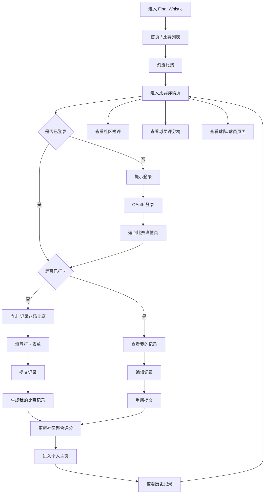
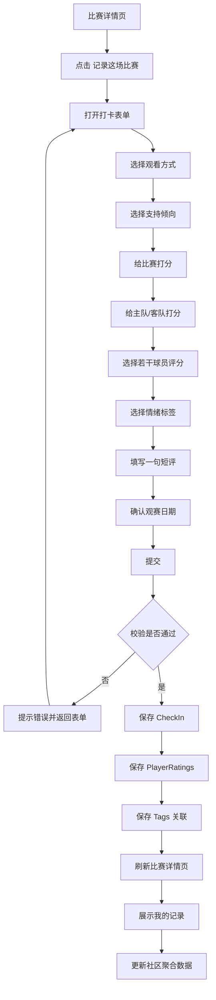
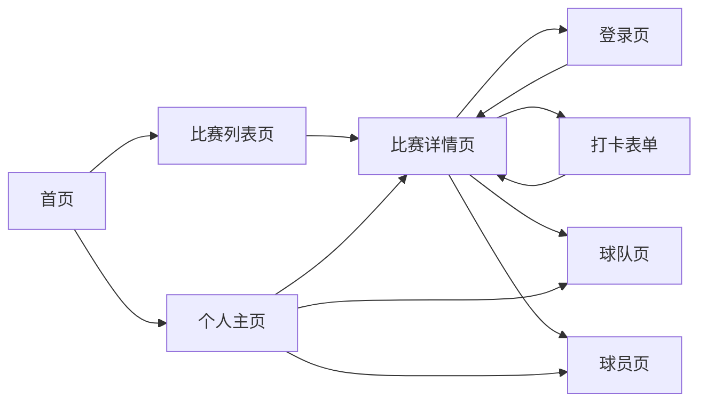
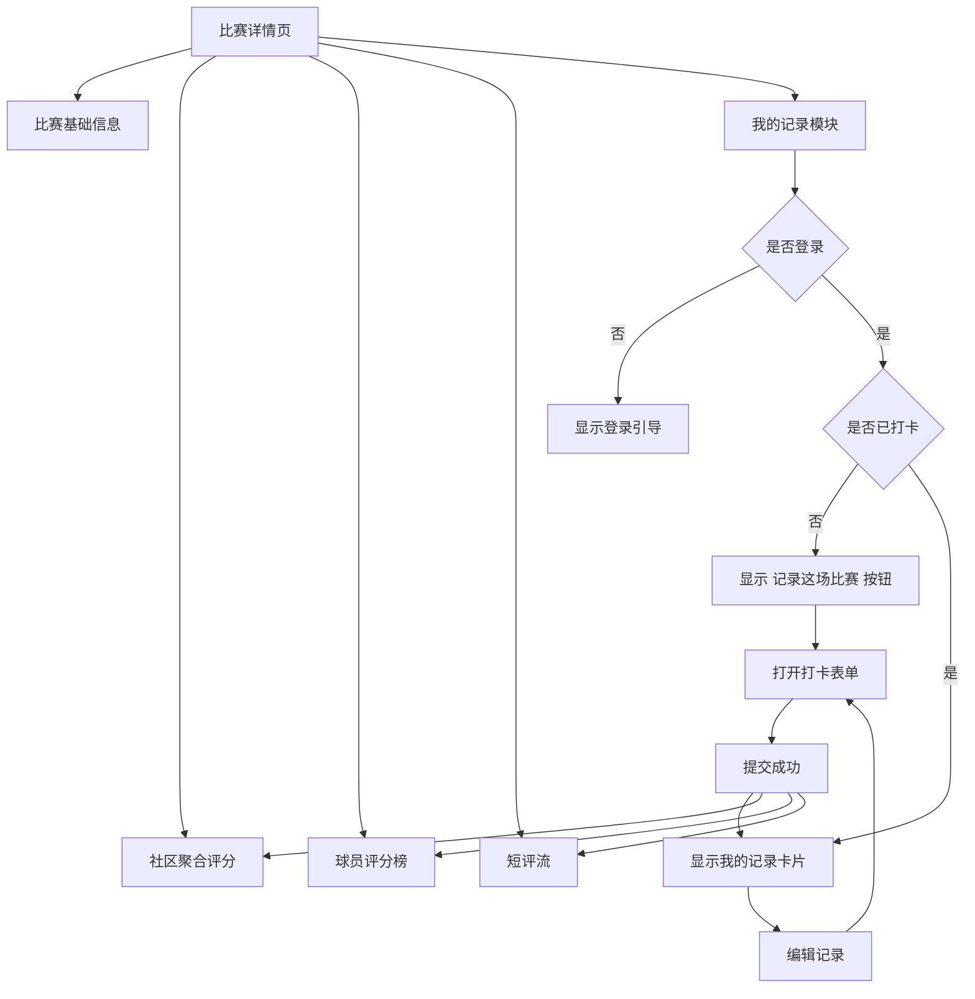
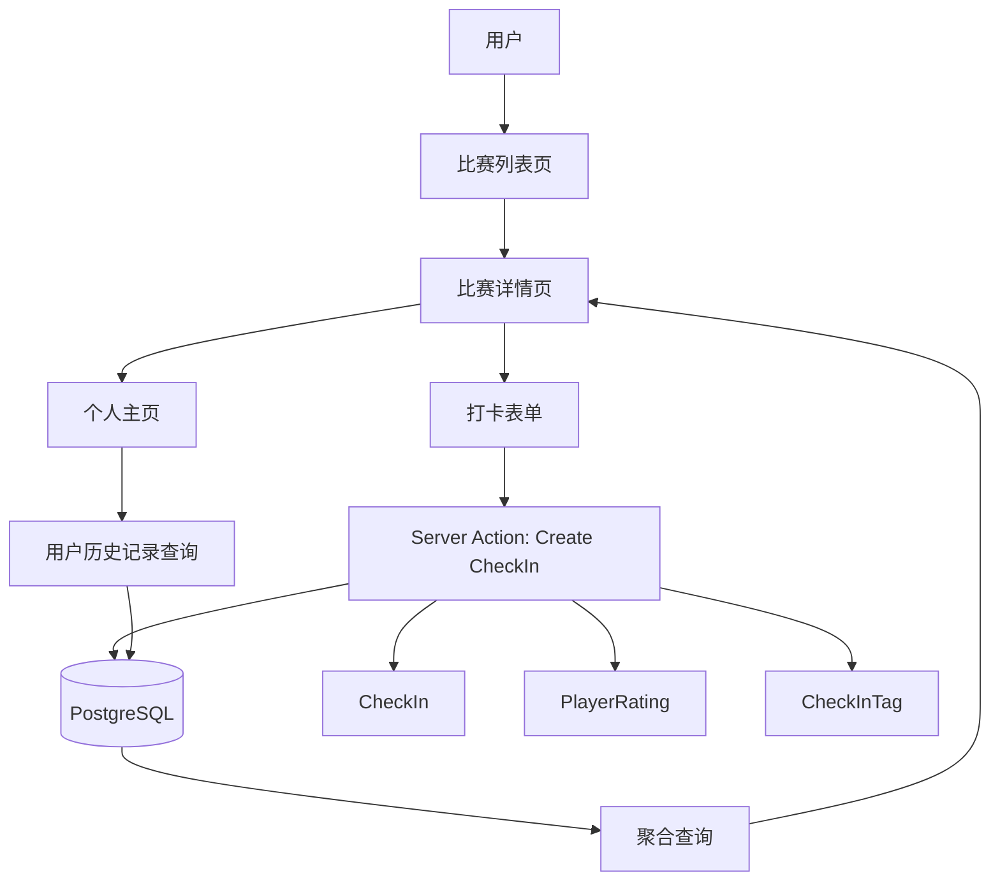

# Final Whistle PRD

## 1. 产品概述

### 1.1 产品名称
**Final Whistle**

### 1.2 一句话定义
一个面向足球观众的观赛记录产品。用户可以记录自己看过的比赛，对比赛、球队、球员进行评分，并留下简短感受，逐步沉淀成个人足球观赛档案。

### 1.3 产品愿景
让“看完一场比赛后留下些什么”这件事变得自然、轻量、可积累。

### 1.4 当前阶段目标
本项目当前目标不是做一个完整的足球社区、数据平台或资讯站，而是做一个 **可在几天内完成、但产品闭环完整的 v1**，用于：
- 验证核心产品形态
- 练习 AI Coding 的先进工作流
- 形成一个后续可扩展的真实项目基础

---

## 2. 背景与问题定义

现在大多数足球产品主要解决的是：
- 看赛程
- 看比分
- 看数据
- 看新闻

但对于普通球迷来说，还有一个没有被很好承接的动作：

> 看完一场比赛后，我想留下自己的感受和判断。

这种需求可能表现为：
- 我想记录我看过哪些比赛
- 我想给一场比赛打分
- 我想评价谁踢得好、谁踢得差
- 我想记住自己当时的感受
- 我想回头看看这个赛季我都看了什么比赛

Final Whistle 希望承接的就是这个“赛后记录”场景。

---

## 3. 产品目标

### 3.1 v1 核心目标
v1 只解决三件事：

1. **记录用户看过哪些比赛**
2. **让用户表达对比赛、球队、球员的评分和短评**
3. **将这些记录沉淀成可回看的个人档案**

### 3.2 非目标
v1 明确不解决以下问题：
- 不做实时比分和赛中互动
- 不做完整足球数据库
- 不做复杂社交关系
- 不做推荐算法
- 不做长内容社区
- 不做赛前预测
- 不做博彩、竞猜或任何相关能力
- 不做复杂的运营后台

---

## 4. 目标用户

### 4.1 核心用户画像

#### 核心用户 A：重度看球用户
特点：
- 经常看比赛
- 对球员、球队有明确看法
- 愿意评分、愿意表达
- 对“记录自己的观赛史”有兴趣

需求：
- 快速记录
- 简单评分
- 可以回看自己的历史记录

#### 核心用户 B：有表达欲的普通球迷
特点：
- 不一定每场都看
- 看重要比赛时很有情绪
- 愿意写一两句感受
- 希望产品使用门槛低

需求：
- 界面简单
- 打卡流程顺滑
- 不需要写长文

#### 核心用户 C：个人型收藏用户
特点：
- 喜欢积累、归档、回顾
- 重视“这是我的足球记录”
- 更在意长期沉淀而非即时互动

需求：
- 用户主页要有“档案感”
- 数据能积累
- 历史记录可查可看

---

## 5. 用户场景

### 场景 1：赛后记录
用户看完一场比赛，打开比赛详情页，提交一条记录：
- 我看了这场比赛
- 我支持哪边
- 我觉得比赛值几分
- 哪个球员表现最好
- 我的感受是什么

### 场景 2：回顾自己看过的比赛
用户进入个人主页，查看：
- 自己最近看过哪些比赛
- 给过哪些高分
- 最常打卡的是哪些球队
- 自己过去写过哪些短评

### 场景 3：查看他人/社区对比赛的整体评价
用户进入某场比赛详情页，想知道：
- 这场比赛整体评分如何
- 两队表现平均分如何
- 哪些球员评分最高
- 最近大家都在怎么评价这场比赛

---

## 6. 用户故事

### 6.1 记录类
- 作为用户，我希望标记“我看过这场比赛”，这样我可以记录自己的观赛历史。
- 作为用户，我希望选择我是完整看完、没看完还是只看了集锦，这样记录更真实。
- 作为用户，我希望填写观赛日期，这样我的记录更准确。

### 6.2 评分类
- 作为用户，我希望给比赛打分，这样我能表达这场比赛是否精彩。
- 作为用户，我希望分别给主队和客队打分，这样我能表达双方表现差异。
- 作为用户，我希望给若干球员打分，这样我能表达更细的判断。

### 6.3 表达类
- 作为用户，我希望写一句短评，这样我能留下自己的赛后感受。
- 作为用户，我希望加上情绪标签，这样我的表达会更轻量也更有趣。

### 6.4 浏览类
- 作为用户，我希望看到比赛详情页上的社区平均评分，这样我能快速了解整体评价。
- 作为用户，我希望在个人主页看到自己的历史记录，这样我能回顾自己的观赛轨迹。

---

## 7. 核心价值主张

Final Whistle 的价值不在于“告诉你比赛发生了什么”，而在于：

> **帮助你记录这场比赛对你意味着什么。**

这让它区别于：
- 赛程/比分产品
- 数据分析产品
- 足球新闻产品

Final Whistle 是一个 **赛后记录与个人足球记忆产品**。

---

## 8. 产品范围

### 8.1 v1 功能范围总览
v1 包含以下模块：

1. 用户登录
2. 比赛列表
3. 比赛详情
4. 比赛打卡与评分
5. 球员评分
6. 短评与标签
7. 社区评分聚合
8. 用户主页
9. 球队/球员简版页面

---

## 9. 用户交互图

### 9.1 整体用户主流程图

### 9.2 核心打卡流程图

### 9.3 页面信息架构 / 跳转图

### 9.4 比赛详情页交互图

### 9.5 系统交互视图

---

## 10. 功能需求详述

### 10.1 用户系统

#### 目标
允许用户登录并拥有自己的观赛档案。

#### 功能点
- 支持第三方登录（优先 OAuth）
- 用户首次登录自动创建账号
- 用户拥有个人主页
- 用户可以查看自己的打卡与评分历史

#### v1 约束
- 不做复杂 profile 编辑
- 不做隐私可见性配置
- 不做用户关系系统

---

### 10.2 比赛列表页

#### 目标
让用户快速找到想记录的比赛。

#### 功能点
- 展示比赛卡片列表
- 卡片展示基本信息：
  - 主客队
  - 比分
  - 比赛时间
  - 赛事
  - 社区平均评分
  - 打卡人数
- 支持筛选：
  - 按赛事
  - 按赛季
- 支持排序：
  - 按比赛时间
- 可选支持搜索球队名

#### v1 约束
- 不做复杂搜索
- 不做无限筛选维度
- 不做高级统计榜单

---

### 10.3 比赛详情页

#### 目标
成为用户完成打卡、查看聚合评价的核心页面。

#### 页面应包含

##### A. 比赛基本信息
- 主客队名称与 logo
- 比分
- 比赛状态
- 开球时间
- 赛事信息
- 赛季 / 轮次 / 场地（有则显示）

##### B. 社区聚合信息
- 平均比赛评分
- 主队平均评分
- 客队平均评分
- 球员平均评分排行
- 总打卡人数

##### C. 用户个人模块
- 未登录时提示登录
- 已登录未打卡时显示“记录这场比赛”
- 已登录已打卡时显示“我的记录”与编辑入口

##### D. 短评流
- 最近若干条用户短评
- 每条短评显示：
  - 用户名/头像
  - 比赛评分
  - 标签
  - 短评内容
  - 发布时间

#### v1 约束
- 不做复杂评论楼中楼
- 不做点赞/回复
- 不做长文战报

---

### 10.4 打卡与评分

#### 目标
提供一个顺滑、结构化的赛后记录流程。

#### 一条打卡记录包含的字段
- watchedType：看完 / 没看完 / 只看集锦
- supporterSide：主队 / 客队 / 中立
- matchRating：比赛评分（1-10）
- homeTeamRating：主队评分（1-10）
- awayTeamRating：客队评分（1-10）
- playerRatings：对若干球员评分
- tags：情绪或印象标签
- shortReview：一句短评
- watchedAt：观赛日期

#### 行为要求
- 用户每场比赛默认只保留一条自己的主记录
- 用户可以编辑已提交记录
- 提交后立即反映到比赛页聚合评分中

#### 交互要求
- 表单应尽量轻量
- 球员评分不要求对全员打分，只允许选部分球员
- 标签可多选
- 短评字数限制合理（例如 140~280 字）

---

### 10.5 球员评分

#### 目标
让用户表达对球员表现的细粒度评价。

#### 功能点
- 在打卡表单中选择本场球员
- 支持对 1~5 名球员评分
- 可选填写简短 note

#### v1 约束
- 不要求用户对全员评分
- 不做复杂最佳阵容
- 不做赛季球员总榜

---

### 10.6 标签系统

#### 目标
让用户更轻量地表达情绪和比赛印象。

#### 建议标签类型
- 热血
- 无聊
- 窒息
- 经典
- 离谱
- 可惜
- 统治力
- 折磨
- 逆转
- 宿命感

#### 功能要求
- 支持多选
- 标签用于：
  - 记录展示
  - 比赛详情页短评增强表达

#### v1 约束
- 不做开放标签创建
- 不做标签广场
- 不做标签趋势分析

---

### 10.7 社区聚合信息

#### 目标
让比赛页有“公共视角”，而不只是个人记录。

#### 需要聚合的内容
- 平均比赛评分
- 平均主队评分
- 平均客队评分
- 球员平均评分
- 打卡人数
- 最近短评

#### 展示要求
- 聚合结果要简洁易读
- 当打卡人数过少时，允许显示“样本较少”
- 无数据时要有空状态

---

### 10.8 用户主页

#### 目标
为用户提供“个人足球档案感”。

#### 页面内容
- 用户基本信息
- 累计打卡场次
- 平均比赛评分
- 最近打卡记录
- 最近短评
- 常打卡球队 / 常评分球员（简版）
- 可进入相关比赛详情页

#### v1 约束
- 不做复杂年度报告
- 不做关注关系
- 不做隐私分组

---

### 10.9 球队页 / 球员页

#### 目标
给用户一个基本落点，用于从比赛页跳转查看。

#### 球队页内容
- 球队基本信息
- 最近相关比赛
- 社区平均评分摘要

#### 球员页内容
- 球员基本信息
- 最近被评分的比赛
- 平均评分摘要

#### v1 约束
- 只做简版
- 不做完整生涯数据
- 不做复杂统计图表

---

## 11. 信息架构

建议 v1 信息架构如下：

- Home
- Matches
  - Match Detail
- Teams
  - Team Detail
- Players
  - Player Detail
- Me
- Auth

---

## 12. 核心流程

### 12.1 主流程：记录一场比赛
1. 用户进入比赛列表
2. 选择一场比赛进入详情页
3. 点击“记录这场比赛”
4. 填写打卡表单
5. 提交成功
6. 比赛详情页展示“我的记录”
7. 社区聚合评分同步更新

### 12.2 回顾流程：查看个人档案
1. 用户进入个人主页
2. 查看最近记录
3. 点击某条记录对应比赛
4. 返回比赛页查看详情与社区评价

---

## 13. 成功指标

v1 不追求大规模增长，主要看产品闭环是否成立。

### 13.1 体验成功指标
- 用户能在 1 分钟内完成一条比赛记录
- 用户能清楚理解“记录”与“评分”的价值
- 用户提交后能直观看到记录被展示出来

### 13.2 产品闭环指标
- 存在完整链路：登录 → 找比赛 → 打卡 → 查看记录 → 回顾历史
- 每场比赛能形成基础聚合信息
- 用户主页有明显“个人档案感”

### 13.3 工程成功指标
- 核心流程可用
- 数据模型清晰
- 页面结构完整
- 可部署上线
- 方便继续扩展

---

## 14. 版本边界

### 14.1 v1 必须完成
- 登录
- 比赛列表页
- 比赛详情页
- 打卡表单
- 比赛/球队/球员评分
- 标签与短评
- 社区聚合评分
- 用户主页

### 14.2 v1.1 可考虑
- 赛后记录卡片
- 更丰富的用户主页摘要
- 更多筛选项
- 更好的空状态与视觉设计

### 14.3 后续版本可能方向
- 年度观赛报告
- 更丰富的球员/球队档案
- 社区互动
- 赛季视图
- 比赛合集
- AI 辅助生成赛后摘要/观赛卡片
- 更广泛的数据源接入

---

## 15. 风险与约束

### 15.1 产品风险
- 范围容易膨胀，变成“大而全足球平台”
- 用户表达流程如果太重，会降低完成率
- 如果比赛数据来源处理不好，会拖慢整体开发

### 15.2 工程风险
- 数据模型一开始设计不清，后续会频繁返工
- 球员评分与比赛聚合逻辑容易复杂化
- 页面过多会分散开发精力

### 15.3 控制策略
- 坚持 v1 范围
- 先做 seed data，不先做复杂 API 接入
- 优先打通主流程，而不是做边角功能
- 将 CheckIn 作为核心聚合单位，避免模型发散

---

## 16. v1 产品原则

1. **先闭环，后扩展**  
2. **先轻量表达，后丰富互动**  
3. **先个人档案，后社区关系**  
4. **先赛后记录，后更多场景**  
5. **先完成核心体验，后追求复杂功能**

---

## 17. 一句话总结

**Final Whistle v1 是一个面向足球观众的赛后记录产品。它帮助用户记录看过的比赛，表达对比赛、球队和球员的评分与感受，并将这些记录沉淀成个人足球观赛档案。**
