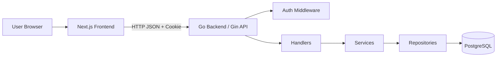

# Final Whistle 技术方案 v2（Go + Gin）

## 1. 文档目标

本文档定义 Final Whistle v1 的可执行技术方案。v2 的目标不是扩大范围，而是把现有方案收口成一个可以直接实施、尽量减少返工的版本。

v1 要解决的主流程只有一条：

`登录 -> 浏览比赛 -> 进入比赛详情 -> 创建/编辑 CheckIn -> 查看聚合 -> 查看个人档案`

---

## 2. v2 相比旧版的关键调整

### 2.1 认证方案定稿

v1 明确采用：

- `HTTP-only Cookie Session`
- `dev login` 作为默认登录方式

不再在 v1 中同时保留 `JWT 或 Cookie Session` 两套方案，也不把 OAuth 作为当前实现前提。

### 2.2 数据来源定稿

v1 仅使用内部 seed data，不接入第三方足球数据 API。

这意味着：

- 比赛、球队、球员、标签全部来自本地 seed
- 不做同步任务
- 不做数据抓取
- 不为外部数据接入设计复杂基础设施

### 2.3 前后端职责统一

系统采用前后端分离单体：

- Next.js 只负责 UI、路由、表单、状态和 API 调用
- Gin 负责鉴权、业务规则、数据读写和聚合查询

v1 不使用 Next.js Server Action 承接业务写入。

### 2.4 聚合和评分规则固定

v1 明确约束：

- 所有评分均为 `1-10` 整数
- 球员评分最多 `5` 名
- 平均分保留 `1` 位小数
- 样本数 `< 3` 时前端提示“样本较少”
- 聚合结果全部实时查询，不做缓存和异步预计算

---

## 3. 技术目标与原则

### 3.1 技术目标

1. 快速交付完整闭环
2. 保持工程结构清晰，便于 AI Coding 协作
3. 控制技术复杂度，优先完成主路径
4. 为后续 OAuth、外部数据源和统计能力保留扩展点

### 3.2 设计原则

#### 1. 单体分层，不做微服务

- 一个前端：Next.js
- 一个后端：Gin API
- 一个数据库：PostgreSQL

#### 2. CheckIn 是业务聚合根

一条 CheckIn 承载：

- watchedType
- supporterSide
- matchRating
- homeTeamRating
- awayTeamRating
- shortReview
- watchedAt

并通过关联表挂载：

- playerRatings
- tags

#### 3. Contract First

在前后端并行前，先固定：

- endpoint
- DTO
- 错误结构
- 枚举值
- 分页格式

#### 4. Seed Data First

v1 一切页面和接口均以 seed data 为前提设计，不引入动态数据同步。

#### 5. 实时聚合优先

v1 不做：

- 预计算统计表
- 消息队列
- 异步聚合任务
- Redis 缓存

---

## 4. 技术栈

### 4.1 前端

- Next.js 15
- TypeScript
- App Router
- Tailwind CSS
- shadcn/ui
- React Hook Form
- Zod

### 4.2 后端

- Go
- Gin
- GORM
- go-playground/validator

### 4.3 数据库

- PostgreSQL

### 4.4 测试

- Frontend: Vitest, Playwright
- Backend: go test, httptest

### 4.5 部署

- Frontend: Vercel
- Backend: Railway / Render / Fly.io / VPS
- Database: Neon / Supabase / Railway Postgres

---

## 5. 系统架构

### 5.1 总体说明



### 5.2 前端职责

- 页面路由
- 页面渲染
- 表单交互
- API 调用
- 登录态展示
- loading / empty / error / unauthorized 状态处理

### 5.3 后端职责

- Cookie Session 鉴权
- 参数校验
- 业务规则校验
- 事务控制
- 数据持久化
- 聚合查询
- 统一错误返回

---

## 6. v1 模块边界

### 6.1 Foundation

- 配置管理
- 数据库连接
- migration
- seed
- router
- 中间件
- 错误处理

### 6.2 Auth

- 登录
- 登出
- 获取当前用户

### 6.3 Match Read

- 比赛列表
- 比赛详情
- 球队详情
- 球员详情

### 6.4 CheckIn Write

- 获取当前用户某场比赛的记录
- 创建记录
- 更新记录

### 6.5 Match Aggregation

- 比赛评分聚合
- 球队评分聚合
- 球员评分排行
- 最近短评

### 6.6 User Profile

- 档案摘要
- 历史记录列表

---

## 7. 数据来源与 Seed 策略

### 7.1 v1 数据来源

仅使用内部 seed data。

建议规模：

- 1 个赛季
- 2 到 4 个赛事
- 20 到 50 场比赛
- 与比赛相关的球队、球员、match_players
- 固定标签字典

### 7.2 设计要求

- 所有实体在数据库中使用内部主键
- 如需为未来外部数据源做准备，可预留 `external_source` 和 `external_id`
- v1 不实现同步任务，不暴露同步接口

---

## 8. 核心实体设计

### 8.1 User

字段：

- `id`
- `name`
- `email`
- `avatar_url`
- `created_at`
- `updated_at`

### 8.2 Team

字段：

- `id`
- `name`
- `short_name`
- `slug`
- `logo_url`
- `created_at`
- `updated_at`

### 8.3 Player

字段：

- `id`
- `team_id`
- `name`
- `slug`
- `position`
- `avatar_url`
- `created_at`
- `updated_at`

### 8.4 Match

字段：

- `id`
- `competition`
- `season`
- `round`
- `status`
- `kickoff_at`
- `home_team_id`
- `away_team_id`
- `home_score`
- `away_score`
- `venue`
- `created_at`
- `updated_at`

### 8.5 MatchPlayer

字段：

- `id`
- `match_id`
- `player_id`
- `team_id`

用途：

- 校验用户打分球员是否属于该场比赛

### 8.6 Tag

字段：

- `id`
- `name`
- `slug`
- `sort_order`
- `is_active`

### 8.7 CheckIn

字段：

- `id`
- `user_id`
- `match_id`
- `watched_type`
- `supporter_side`
- `match_rating`
- `home_team_rating`
- `away_team_rating`
- `short_review`
- `watched_at`
- `created_at`
- `updated_at`

约束：

- 唯一索引：`(user_id, match_id)`
- `short_review` 最大 280 字

### 8.8 PlayerRating

字段：

- `id`
- `check_in_id`
- `player_id`
- `rating`
- `note`

约束：

- 单条 CheckIn 最多 5 条
- `note` 最大 80 字

### 8.9 CheckInTag

字段：

- `id`
- `check_in_id`
- `tag_id`

---

## 9. 枚举与业务规则

### 9.1 watched_type

- `FULL`
- `PARTIAL`
- `HIGHLIGHTS`

### 9.2 supporter_side

- `HOME`
- `AWAY`
- `NEUTRAL`

### 9.3 match.status

- `SCHEDULED`
- `FINISHED`

v1 仅允许对 `FINISHED` 的比赛创建或编辑 CheckIn。

### 9.4 评分规则

- `matchRating`: 1-10
- `homeTeamRating`: 1-10
- `awayTeamRating`: 1-10
- `playerRatings[].rating`: 1-10

全部为整数。

### 9.5 文本规则

- `shortReview`: 可选，最大 280 字
- `playerRatings[].note`: 可选，最大 80 字

### 9.6 标签规则

- 标签来自固定字典
- 只允许选择启用中的标签
- v1 不支持用户创建标签

### 9.7 聚合规则

- 聚合基于当前所有有效 CheckIn
- 平均分保留 1 位小数
- 样本数小于 3 时由前端提示“样本较少”
- 无数据时返回 `null` 或空数组，不造默认值

---

## 10. 目录结构建议

### 10.1 前端

```txt
frontend/
  src/
    app/
      page.tsx
      login/
        page.tsx
      matches/
        page.tsx
        [matchId]/
          page.tsx
      teams/
        [teamId]/
          page.tsx
      players/
        [playerId]/
          page.tsx
      me/
        page.tsx

    components/
      ui/
      layout/
      auth/
      matches/
      checkins/
      profile/
      teams/
      players/

    lib/
      api/
        client.ts
        auth.ts
        matches.ts
        checkins.ts
        teams.ts
        players.ts
        users.ts
      validations/
      utils/

    types/
      api.ts
      domain.ts
```

### 10.2 后端

```txt
backend/
  cmd/
    api/
      main.go

  internal/
    config/
    db/
    middleware/
    router/

    handler/
      auth_handler.go
      match_handler.go
      checkin_handler.go
      team_handler.go
      player_handler.go
      user_handler.go

    service/
      auth_service.go
      match_service.go
      checkin_service.go
      team_service.go
      player_service.go
      user_service.go

    repository/
      user_repository.go
      match_repository.go
      checkin_repository.go
      team_repository.go
      player_repository.go
      tag_repository.go
      session_repository.go

    dto/
      auth_dto.go
      match_dto.go
      checkin_dto.go
      team_dto.go
      player_dto.go
      user_dto.go
      common_dto.go

    model/
      user.go
      team.go
      player.go
      match.go
      match_player.go
      checkin.go
      player_rating.go
      tag.go
      checkin_tag.go
      session.go

    utils/

  migrations/
  seed/
  go.mod
```

---

## 11. API 设计总览

### 11.1 Auth

- `POST /auth/login`
- `POST /auth/logout`
- `GET /auth/me`

### 11.2 Match

- `GET /matches`
- `GET /matches/:id`

### 11.3 CheckIn

- `GET /matches/:id/my-checkin`
- `POST /matches/:id/checkin`
- `PUT /matches/:id/checkin`

### 11.4 Team / Player

- `GET /teams/:id`
- `GET /players/:id`

### 11.5 User

- `GET /me/profile`
- `GET /me/checkins`

---

## 12. 统一 API 约定

### 12.1 成功返回

```json
{
  "success": true,
  "data": {}
}
```

### 12.2 错误返回

```json
{
  "success": false,
  "error": {
    "code": "VALIDATION_ERROR",
    "message": "invalid request body",
    "details": {}
  }
}
```

### 12.3 错误码

- `UNAUTHORIZED`
- `FORBIDDEN`
- `NOT_FOUND`
- `VALIDATION_ERROR`
- `CONFLICT`
- `INTERNAL_ERROR`

### 12.4 分页规范

列表接口统一返回：

- `items`
- `page`
- `pageSize`
- `total`

默认：

- `page=1`
- `pageSize=20`
- 最大 `pageSize=50`

### 12.5 命名规范

- API DTO：`camelCase`
- DB 表和列：`snake_case`
- 枚举值：全大写

---

## 13. 关键接口定义

### 13.1 `POST /auth/login`

目标：

- 使用 `dev login` 建立会话

请求体示例：

```json
{
  "email": "demo@example.com",
  "name": "Demo User"
}
```

行为：

- 用户存在则复用
- 用户不存在则自动创建
- 创建 session
- 通过 HTTP-only Cookie 回写登录态

### 13.2 `POST /auth/logout`

目标：

- 清除当前 session 和 cookie

### 13.3 `GET /auth/me`

目标：

- 获取当前登录用户信息

### 13.4 `GET /matches`

查询参数：

- `competition`
- `season`
- `page`
- `pageSize`

返回：

- 比赛列表
- 每场比赛的聚合摘要

### 13.5 `GET /matches/:id`

返回：

- 比赛基础信息
- 平均比赛评分
- 平均主队评分
- 平均客队评分
- 球员评分排行
- 最近短评
- 打卡人数

### 13.6 `GET /matches/:id/my-checkin`

要求：

- 受保护接口

返回：

- 当前用户在该比赛上的完整记录
- 若不存在，返回 `data: null`

### 13.7 `POST /matches/:id/checkin`

要求：

- 受保护接口

校验：

- 比赛存在
- 比赛状态为 `FINISHED`
- 用户尚未创建记录
- 被评分球员属于该比赛
- 标签合法

事务写入：

- `check_ins`
- `player_ratings`
- `checkin_tags`

### 13.8 `PUT /matches/:id/checkin`

要求：

- 受保护接口

校验：

- 记录存在
- 比赛状态为 `FINISHED`
- 球员属于比赛
- 标签合法

事务更新：

- 更新 `check_ins`
- 替换 `player_ratings`
- 替换 `checkin_tags`

### 13.9 `GET /teams/:id`

返回：

- 球队基础信息
- 最近比赛
- 平均评分摘要

### 13.10 `GET /players/:id`

返回：

- 球员基础信息
- 最近被评分比赛
- 平均评分摘要

### 13.11 `GET /me/profile`

返回：

- 用户基础信息
- 总打卡数
- 平均比赛评分
- 最近打卡
- 最近短评
- 常打卡球队前 3
- 常评分球员前 3

### 13.12 `GET /me/checkins`

返回：

- 当前用户历史记录列表

---

## 14. 鉴权设计

### 14.1 v1 方案

采用 Cookie Session。

服务端职责：

- 创建 session 记录
- 通过 HTTP-only Cookie 下发 session 标识
- 在中间件中解析并校验 session

前端职责：

- 使用 `credentials: include` 发起请求
- 依据 `/auth/me` 恢复登录态

### 14.2 公开接口

- `GET /matches`
- `GET /matches/:id`
- `GET /teams/:id`
- `GET /players/:id`

### 14.3 受保护接口

- `POST /auth/logout`
- `GET /auth/me`
- `GET /matches/:id/my-checkin`
- `POST /matches/:id/checkin`
- `PUT /matches/:id/checkin`
- `GET /me/profile`
- `GET /me/checkins`

---

## 15. 前端页面到接口映射

### `/matches`

- `GET /matches`

### `/matches/[matchId]`

- `GET /matches/:id`
- 登录后调用 `GET /matches/:id/my-checkin`

### 打卡表单提交

- `POST /matches/:id/checkin`
- `PUT /matches/:id/checkin`

### `/teams/[teamId]`

- `GET /teams/:id`

### `/players/[playerId]`

- `GET /players/:id`

### `/me`

- `GET /auth/me`
- `GET /me/profile`
- `GET /me/checkins`

---

## 16. 事务与错误处理

### 16.1 必须使用事务的场景

- 创建 CheckIn
- 更新 CheckIn

原因：

- 需要同时维护主记录、球员评分、标签关联

### 16.2 错误分层

- Handler：参数错误、请求体错误
- Service：业务规则错误
- Repository：数据库访问错误

### 16.3 推荐业务错误

- 重复创建记录：`CONFLICT`
- 比赛未结束：`VALIDATION_ERROR`
- 球员不属于比赛：`VALIDATION_ERROR`
- 登录态无效：`UNAUTHORIZED`

---

## 17. 测试策略

### 17.1 后端重点

- `AuthService.Login`
- `CheckInService.CreateCheckIn`
- `CheckInService.UpdateCheckIn`
- `MatchService.GetMatchDetail`
- `UserService.GetProfileSummary`

### 17.2 Handler 测试

覆盖：

- 登录
- 登出
- 获取当前用户
- 创建打卡
- 更新打卡
- 获取比赛详情
- 获取个人主页

### 17.3 前端 E2E

覆盖主路径：

1. 登录
2. 浏览比赛列表
3. 打开比赛详情
4. 创建 CheckIn
5. 编辑 CheckIn
6. 打开个人主页

---

## 18. 开发顺序建议

### Phase 1

- Foundation
- migration
- seed
- 基础模型

### Phase 2

- `GET /matches`
- `GET /matches/:id`
- `GET /teams/:id`
- `GET /players/:id`

### Phase 3

- `POST /auth/login`
- `POST /auth/logout`
- `GET /auth/me`
- `GET /matches/:id/my-checkin`
- `POST /matches/:id/checkin`
- `PUT /matches/:id/checkin`

### Phase 4

- `GET /me/profile`
- `GET /me/checkins`

### Phase 5

- 前端串联
- loading / empty / error 完善
- E2E
- 部署

---

## 19. 完成定义

满足以下条件即视为 v1 技术方案落地完成：

1. 前后端工程可启动
2. seed data 可导入
3. 用户可登录并维持会话
4. 用户可浏览比赛并查看详情
5. 用户可创建和编辑唯一一条 CheckIn
6. 比赛详情页可展示聚合与短评
7. 个人主页可展示档案摘要与历史记录
8. 核心路径测试通过

---

## 20. 后续扩展点

以下能力明确延后到 v1.1 或更后版本：

- GitHub OAuth
- 外部足球数据同步
- 年度观赛报告
- 更丰富的统计页
- 社区互动能力
- AI 赛后卡片
