# Final Whistle 技术方案（Go + Gin 版）

## 1. 文档目标

本文档定义 Final Whistle v1 的技术架构，目标是：

- 以 **Next.js + Go(Gin) + PostgreSQL** 为核心完成一个可上线的 v1
- 保持工程结构清晰，便于 **Codex / Claude Code** 协作开发
- 用尽量少的基础设施完成“登录 → 找比赛 → 打卡 → 查看聚合 → 查看个人档案”的主流程
- 在控制复杂度的前提下，保留后续扩展空间

---

## 2. 技术目标与设计原则

### 2.1 技术目标

1. **快速完成闭环**
   - 支持登录
   - 支持浏览比赛
   - 支持打卡与评分
   - 支持查看个人主页
   - 支持比赛页聚合展示

2. **服务端使用 Go**
   - 核心业务逻辑放在 Go 后端
   - Next.js 主要负责前端 UI、路由、表单交互和 API 调用

3. **适合 AI Coding**
   - 模块边界清晰
   - 目录职责清晰
   - API 契约明确
   - 文档可持续维护

4. **可继续扩展**
   - 后续可增加：
     - 年度观赛报告
     - 更丰富的统计页
     - 外部足球数据接入
     - AI 观赛卡片
     - 社区功能

### 2.2 设计原则

#### 1. 前后端分离，但只拆两层
- 一个前端：Next.js
- 一个后端：Go Gin API
- 一个数据库：PostgreSQL

不拆微服务，不拆消息队列，不引入不必要中间件。

#### 2. CheckIn 是业务聚合根
一次完整的观赛记录就是一条 `CheckIn`，它挂载：
- 比赛评分
- 球队评分
- 球员评分
- 标签
- 短评
- 观看方式
- 支持倾向

#### 3. API Contract First
因为前后端跨语言，必须先明确：
- endpoint
- request/response DTO
- 错误返回格式
- 字段命名规范

#### 4. 先实时查询，后优化
v1 不做：
- 预计算统计表
- 复杂缓存
- 异步聚合任务

先让主流程跑通。

#### 5. 单一职责分层
Go 后端按以下结构组织：
- handler：HTTP 层
- service：业务层
- repository：数据访问层
- dto：请求/响应结构
- model：数据库模型

---

## 3. 技术栈

### 3.1 前端
- **Next.js 15**
- **TypeScript**
- **App Router**
- **Tailwind CSS**
- **shadcn/ui**
- **React Hook Form**
- **Zod**

### 3.2 后端
- **Go**
- **Gin**
- **GORM**
- **go-playground/validator**（可选）
- **JWT 或 Cookie Session**

### 3.3 数据库
- **PostgreSQL**

### 3.4 测试
- Frontend：
  - Vitest
  - Playwright
- Backend：
  - Go test
  - httptest

### 3.5 部署
- Frontend：Vercel
- Backend：Railway / Render / Fly.io / VPS
- Database：Neon / Supabase / Railway Postgres

---

## 4. 系统整体架构

### 4.1 总体说明

系统采用 **前后端分离单体架构**：

- Next.js 负责页面渲染、交互、表单、API 调用
- Gin 负责业务逻辑、鉴权、数据读写、聚合计算
- PostgreSQL 负责核心数据存储

### 4.2 整体架构图

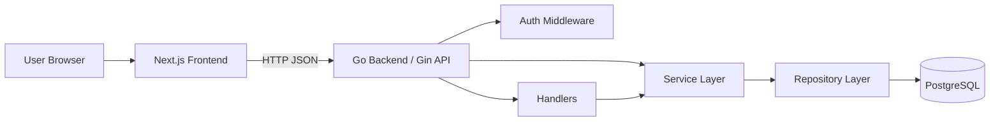
```mermaid
flowchart LR
    U[User Browser] --> F[Next.js Frontend]
    F -->|HTTP JSON| B[Go Backend / Gin API]
    B --> O[Service Layer]
    O --> R[Repository Layer]
    R --> D[(PostgreSQL)]

    B --> A[Auth Middleware]
    B --> H[Handlers]
    H --> O
```

### 4.3 前后端职责边界

#### 前端职责
- 页面路由
- 页面展示
- 表单交互
- 发起 API 调用
- 展示登录状态
- 管理少量本地 UI 状态

#### 后端职责
- 鉴权
- API 输入校验
- 业务规则处理
- 数据持久化
- 聚合查询
- 统一错误返回
- 访问权限控制

---

## 5. 目录结构建议

### 5.1 前端目录结构

```txt
frontend/
  src/
    app/
      page.tsx
      matches/
        page.tsx
        [matchId]/
          page.tsx
      teams/
        [teamId]/
          page.tsx
      players/
        [playerId]/
          page.tsx
      me/
        page.tsx
      login/
        page.tsx

    components/
      ui/
      layout/
      matches/
      checkins/
      reviews/
      profile/
      teams/
      players/

    lib/
      api/
        client.ts
        auth.ts
        matches.ts
        checkins.ts
        teams.ts
        players.ts
        users.ts
      validations/
      utils/

    types/
      api.ts
      domain.ts
```

### 5.2 后端目录结构

```txt
backend/
  cmd/
    api/
      main.go

  internal/
    config/
    db/
    middleware/
    router/

    handler/
      auth_handler.go
      match_handler.go
      checkin_handler.go
      team_handler.go
      player_handler.go
      user_handler.go

    service/
      auth_service.go
      match_service.go
      checkin_service.go
      team_service.go
      player_service.go
      user_service.go

    repository/
      user_repository.go
      match_repository.go
      checkin_repository.go
      team_repository.go
      player_repository.go
      tag_repository.go

    dto/
      auth_dto.go
      match_dto.go
      checkin_dto.go
      team_dto.go
      player_dto.go
      user_dto.go
      common_dto.go

    model/
      user.go
      team.go
      player.go
      match.go
      match_player.go
      checkin.go
      player_rating.go
      tag.go
      checkin_tag.go

    utils/

  migrations/
  seed/
  go.mod
```

---

## 6. 核心模块设计

### 6.1 Auth 模块
职责：
- 登录
- 登出
- 获取当前用户信息
- 令牌或会话校验

### 6.2 Match 模块
职责：
- 获取比赛列表
- 获取比赛详情
- 获取比赛聚合评分
- 获取比赛短评流
- 获取比赛中的当前用户打卡信息

### 6.3 CheckIn 模块
职责：
- 创建打卡
- 更新打卡
- 获取用户对某比赛的打卡
- 保存球员评分
- 保存标签关联

### 6.4 Team / Player 模块
职责：
- 获取球队详情
- 获取球员详情
- 获取相关比赛与平均评分摘要

### 6.5 User Profile 模块
职责：
- 获取个人主页摘要
- 获取最近打卡
- 获取最近短评
- 获取基础统计

---

## 7. 数据模型与 Schema 原则

### 7.1 核心实体
- User
- Team
- Player
- Match
- MatchPlayer
- CheckIn
- PlayerRating
- Tag
- CheckInTag

### 7.2 核心建模原则

#### 1. CheckIn 是聚合根
一条 CheckIn 统一承载：
- watchedType
- supporterSide
- matchRating
- homeTeamRating
- awayTeamRating
- shortReview
- watchedAt

球员评分和标签通过关联表挂在 CheckIn 下。

#### 2. 一名用户对一场比赛只允许一条主记录
通过唯一索引约束：
- `(user_id, match_id)`

#### 3. 尽量结构化，不要滥用 JSON
像评分、标签、观看方式等字段都应显式建模。

#### 4. v1 聚合结果实时计算
比赛详情页的平均评分、球员评分排行等直接通过查询计算。

---

## 8. API 设计总览

### 8.1 认证
- `POST /auth/login`
- `POST /auth/logout`
- `GET /auth/me`

### 8.2 比赛
- `GET /matches`
- `GET /matches/:id`

### 8.3 打卡
- `GET /matches/:id/my-checkin`
- `POST /matches/:id/checkin`
- `PUT /matches/:id/checkin`

### 8.4 球队 / 球员
- `GET /teams/:id`
- `GET /players/:id`

### 8.5 用户
- `GET /me/profile`
- `GET /me/checkins`

---

## 9. 统一 API 约定

### 9.1 成功返回格式

```json
{
  "success": true,
  "data": {}
}
```

### 9.2 错误返回格式

```json
{
  "success": false,
  "error": {
    "code": "VALIDATION_ERROR",
    "message": "invalid request body",
    "details": {}
  }
}
```

### 9.3 常见错误码
- `UNAUTHORIZED`
- `FORBIDDEN`
- `NOT_FOUND`
- `VALIDATION_ERROR`
- `CONFLICT`
- `INTERNAL_ERROR`

---

## 10. 接口详细设计、流程图与交互图

---

# 10.1 POST /auth/login

## 目标
用户登录并获取身份凭证。

## 请求体示例

```json
{
  "provider": "dev",
  "email": "demo@example.com",
  "name": "Demo User"
}
```

## 成功响应示例

```json
{
  "success": true,
  "data": {
    "user": {
      "id": 1,
      "name": "Demo User",
      "email": "demo@example.com"
    },
    "token": "jwt_or_session_token"
  }
}
```

## 接口流程图

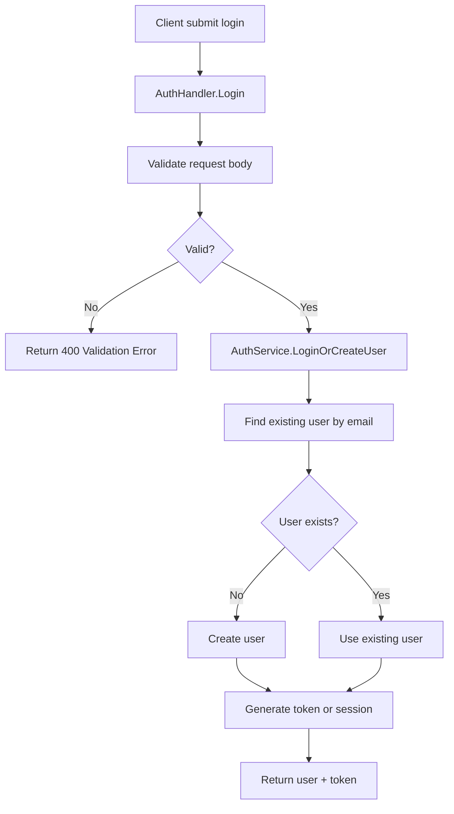
```mermaid
flowchart TD
    A[Client submit login] --> B[AuthHandler.Login]
    B --> C[Validate request body]
    C --> D{Valid?}
    D -- No --> E[Return 400 Validation Error]
    D -- Yes --> F[AuthService.LoginOrCreateUser]
    F --> G[Find existing user by email]
    G --> H{User exists?}
    H -- No --> I[Create user]
    H -- Yes --> J[Use existing user]
    I --> K[Generate token or session]
    J --> K
    K --> L[Return user + token]
```

## 前后端交互图

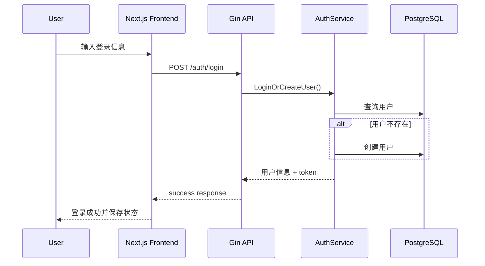
```mermaid
sequenceDiagram
    participant U as User
    participant FE as Next.js Frontend
    participant API as Gin API
    participant S as AuthService
    participant DB as PostgreSQL

    U->>FE: 输入登录信息
    FE->>API: POST /auth/login
    API->>S: LoginOrCreateUser()
    S->>DB: 查询用户
    alt 用户不存在
        S->>DB: 创建用户
    end
    S-->>API: 用户信息 + token
    API-->>FE: success response
    FE-->>U: 登录成功并保存状态
```

---

# 10.2 GET /auth/me

## 目标
获取当前登录用户信息。

## 接口流程图

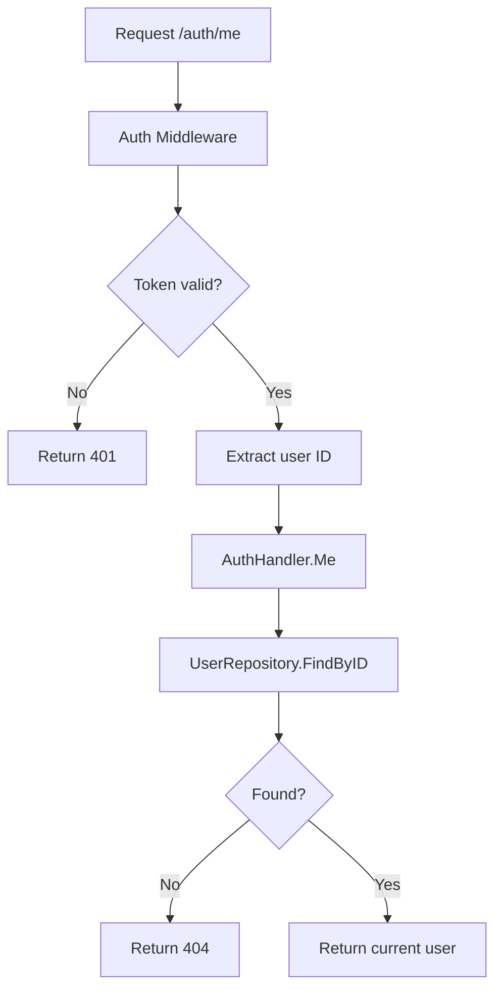
```mermaid
flowchart TD
    A[Request /auth/me] --> B[Auth Middleware]
    B --> C{Token valid?}
    C -- No --> D[Return 401]
    C -- Yes --> E[Extract user ID]
    E --> F[AuthHandler.Me]
    F --> G[UserRepository.FindByID]
    G --> H{Found?}
    H -- No --> I[Return 404]
    H -- Yes --> J[Return current user]
```

## 前后端交互图

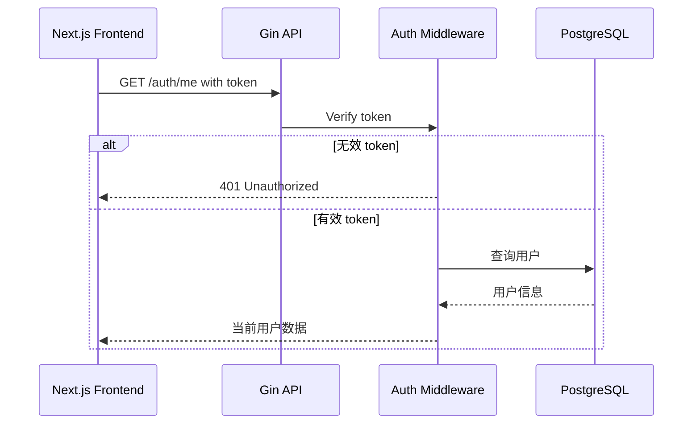
```mermaid
sequenceDiagram
    participant FE as Next.js Frontend
    participant API as Gin API
    participant MW as Auth Middleware
    participant DB as PostgreSQL

    FE->>API: GET /auth/me with token
    API->>MW: Verify token
    alt 无效 token
        MW-->>FE: 401 Unauthorized
    else 有效 token
        MW->>DB: 查询用户
        DB-->>MW: 用户信息
        MW-->>FE: 当前用户数据
    end
```

---

# 10.3 GET /matches

## 目标
获取比赛列表。

## 查询参数
- `competition`
- `season`
- `page`
- `pageSize`
- `keyword`（可选）

## 接口流程图

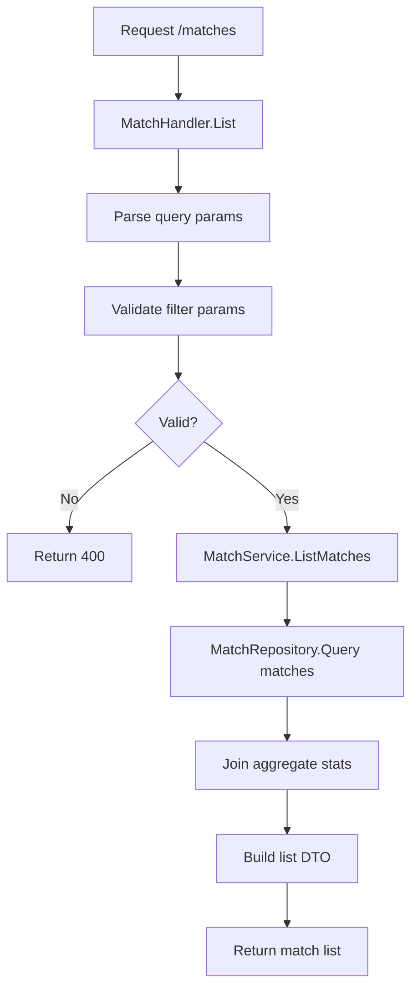
```mermaid
flowchart TD
    A[Request /matches] --> B[MatchHandler.List]
    B --> C[Parse query params]
    C --> D[Validate filter params]
    D --> E{Valid?}
    E -- No --> F[Return 400]
    E -- Yes --> G[MatchService.ListMatches]
    G --> H[MatchRepository.Query matches]
    H --> I[Join aggregate stats]
    I --> J[Build list DTO]
    J --> K[Return match list]
```

## 前后端交互图

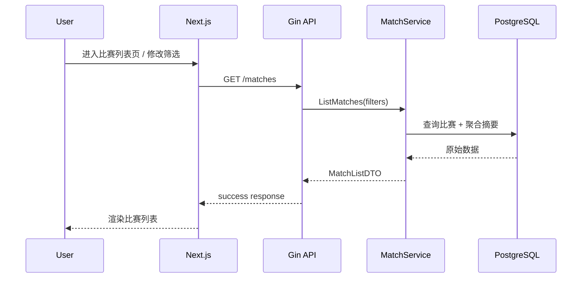
```mermaid
sequenceDiagram
    participant U as User
    participant FE as Next.js
    participant API as Gin API
    participant S as MatchService
    participant DB as PostgreSQL

    U->>FE: 进入比赛列表页 / 修改筛选
    FE->>API: GET /matches
    API->>S: ListMatches(filters)
    S->>DB: 查询比赛 + 聚合摘要
    DB-->>S: 原始数据
    S-->>API: MatchListDTO
    API-->>FE: success response
    FE-->>U: 渲染比赛列表
```

---

# 10.4 GET /matches/:id

## 目标
获取比赛详情页完整信息。

## 返回内容
- 比赛基础信息
- 平均比赛评分
- 主客队平均评分
- 球员平均评分排行
- 最近短评
- 打卡人数

## 接口流程图

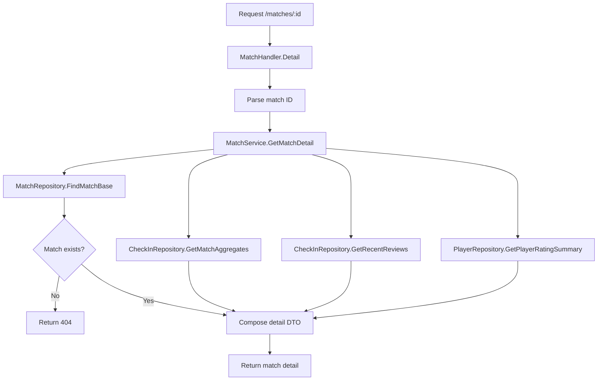
```mermaid
flowchart TD
    A[Request /matches/:id] --> B[MatchHandler.Detail]
    B --> C[Parse match ID]
    C --> D[MatchService.GetMatchDetail]
    D --> E[MatchRepository.FindMatchBase]
    D --> F[CheckInRepository.GetMatchAggregates]
    D --> G[CheckInRepository.GetRecentReviews]
    D --> H[PlayerRepository.GetPlayerRatingSummary]
    E --> I{Match exists?}
    I -- No --> J[Return 404]
    I -- Yes --> K[Compose detail DTO]
    F --> K
    G --> K
    H --> K
    K --> L[Return match detail]
```

## 前后端交互图

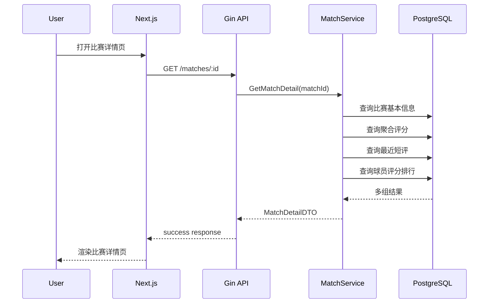
```mermaid
sequenceDiagram
    participant U as User
    participant FE as Next.js
    participant API as Gin API
    participant S as MatchService
    participant DB as PostgreSQL

    U->>FE: 打开比赛详情页
    FE->>API: GET /matches/:id
    API->>S: GetMatchDetail(matchId)
    S->>DB: 查询比赛基本信息
    S->>DB: 查询聚合评分
    S->>DB: 查询最近短评
    S->>DB: 查询球员评分排行
    DB-->>S: 多组结果
    S-->>API: MatchDetailDTO
    API-->>FE: success response
    FE-->>U: 渲染比赛详情页
```

---

# 10.5 GET /matches/:id/my-checkin

## 目标
获取当前用户对某场比赛的已有打卡。

## 接口流程图

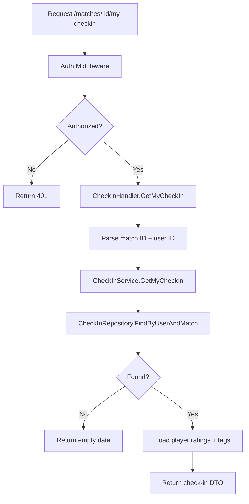
```mermaid
flowchart TD
    A[Request /matches/:id/my-checkin] --> B[Auth Middleware]
    B --> C{Authorized?}
    C -- No --> D[Return 401]
    C -- Yes --> E[CheckInHandler.GetMyCheckIn]
    E --> F[Parse match ID + user ID]
    F --> G[CheckInService.GetMyCheckIn]
    G --> H[CheckInRepository.FindByUserAndMatch]
    H --> I{Found?}
    I -- No --> J[Return empty data]
    I -- Yes --> K[Load player ratings + tags]
    K --> L[Return check-in DTO]
```

## 前后端交互图

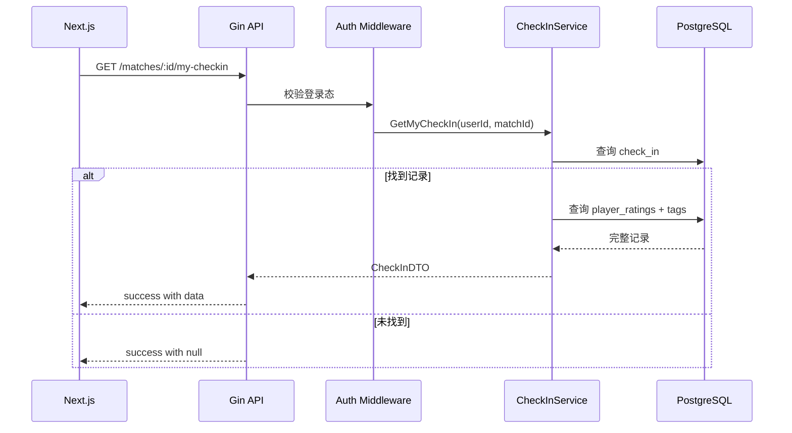
```mermaid
sequenceDiagram
    participant FE as Next.js
    participant API as Gin API
    participant MW as Auth Middleware
    participant S as CheckInService
    participant DB as PostgreSQL

    FE->>API: GET /matches/:id/my-checkin
    API->>MW: 校验登录态
    MW->>S: GetMyCheckIn(userId, matchId)
    S->>DB: 查询 check_in
    alt 找到记录
        S->>DB: 查询 player_ratings + tags
        DB-->>S: 完整记录
        S-->>API: CheckInDTO
        API-->>FE: success with data
    else 未找到
        API-->>FE: success with null
    end
```

---

# 10.6 POST /matches/:id/checkin

## 目标
创建当前用户对某场比赛的打卡记录。

## 请求体示例

```json
{
  "watchedType": "FULL",
  "supporterSide": "HOME",
  "matchRating": 8,
  "homeTeamRating": 9,
  "awayTeamRating": 6,
  "shortReview": "A tense and unforgettable match.",
  "watchedAt": "2026-03-24T20:00:00Z",
  "tags": [1, 4],
  "playerRatings": [
    {
      "playerId": 101,
      "rating": 9,
      "note": "Best player on the pitch"
    },
    {
      "playerId": 102,
      "rating": 8,
      "note": ""
    }
  ]
}
```

## 接口流程图

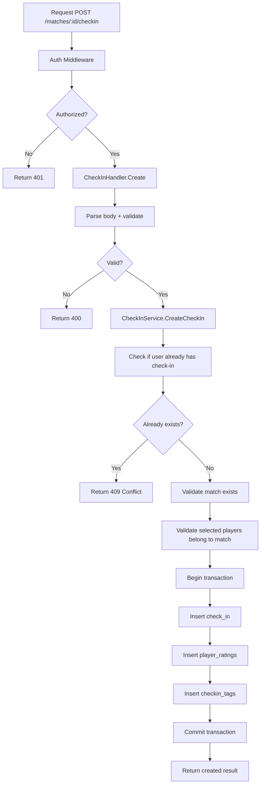
```mermaid
flowchart TD
    A[Request POST /matches/:id/checkin] --> B[Auth Middleware]
    B --> C{Authorized?}
    C -- No --> D[Return 401]
    C -- Yes --> E[CheckInHandler.Create]
    E --> F[Parse body + validate]
    F --> G{Valid?}
    G -- No --> H[Return 400]
    G -- Yes --> I[CheckInService.CreateCheckIn]
    I --> J[Check if user already has check-in]
    J --> K{Already exists?}
    K -- Yes --> L[Return 409 Conflict]
    K -- No --> M[Validate match exists]
    M --> N[Validate selected players belong to match]
    N --> O[Begin transaction]
    O --> P[Insert check_in]
    P --> Q[Insert player_ratings]
    Q --> R[Insert checkin_tags]
    R --> S[Commit transaction]
    S --> T[Return created result]
```

## 前后端交互图

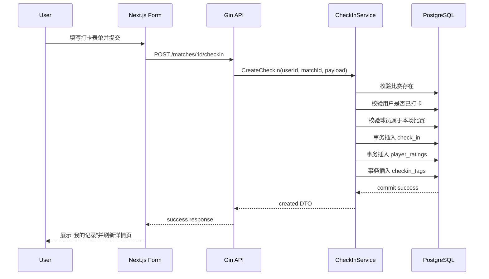
```mermaid
sequenceDiagram
    participant U as User
    participant FE as Next.js Form
    participant API as Gin API
    participant S as CheckInService
    participant DB as PostgreSQL

    U->>FE: 填写打卡表单并提交
    FE->>API: POST /matches/:id/checkin
    API->>S: CreateCheckIn(userId, matchId, payload)
    S->>DB: 校验比赛存在
    S->>DB: 校验用户是否已打卡
    S->>DB: 校验球员属于本场比赛
    S->>DB: 事务插入 check_in
    S->>DB: 事务插入 player_ratings
    S->>DB: 事务插入 checkin_tags
    DB-->>S: commit success
    S-->>API: created DTO
    API-->>FE: success response
    FE-->>U: 展示“我的记录”并刷新详情页
```

---

# 10.7 PUT /matches/:id/checkin

## 目标
更新当前用户对某场比赛的打卡记录。

## 接口流程图

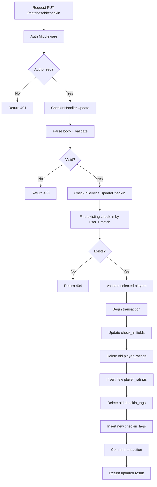
```mermaid
flowchart TD
    A[Request PUT /matches/:id/checkin] --> B[Auth Middleware]
    B --> C{Authorized?}
    C -- No --> D[Return 401]
    C -- Yes --> E[CheckInHandler.Update]
    E --> F[Parse body + validate]
    F --> G{Valid?}
    G -- No --> H[Return 400]
    G -- Yes --> I[CheckInService.UpdateCheckIn]
    I --> J[Find existing check-in by user + match]
    J --> K{Exists?}
    K -- No --> L[Return 404]
    K -- Yes --> M[Validate selected players]
    M --> N[Begin transaction]
    N --> O[Update check_in fields]
    O --> P[Delete old player_ratings]
    P --> Q[Insert new player_ratings]
    Q --> R[Delete old checkin_tags]
    R --> S[Insert new checkin_tags]
    S --> T[Commit transaction]
    T --> U[Return updated result]
```

## 前后端交互图

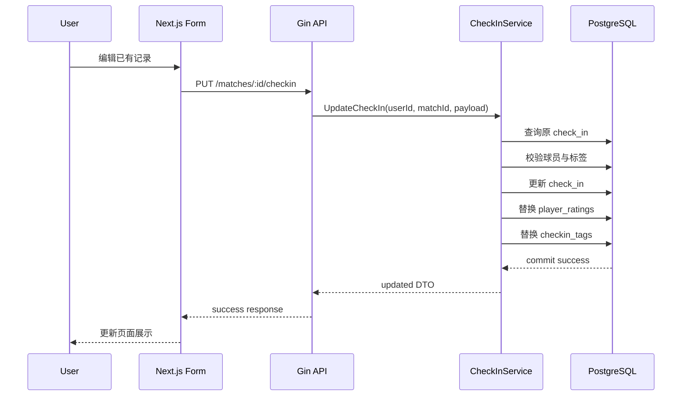
```mermaid
sequenceDiagram
    participant U as User
    participant FE as Next.js Form
    participant API as Gin API
    participant S as CheckInService
    participant DB as PostgreSQL

    U->>FE: 编辑已有记录
    FE->>API: PUT /matches/:id/checkin
    API->>S: UpdateCheckIn(userId, matchId, payload)
    S->>DB: 查询原 check_in
    S->>DB: 校验球员与标签
    S->>DB: 更新 check_in
    S->>DB: 替换 player_ratings
    S->>DB: 替换 checkin_tags
    DB-->>S: commit success
    S-->>API: updated DTO
    API-->>FE: success response
    FE-->>U: 更新页面展示
```

---

# 10.8 GET /teams/:id

## 目标
获取球队详情页数据。

## 返回内容
- 球队基本信息
- 最近比赛
- 社区平均评分摘要

## 接口流程图

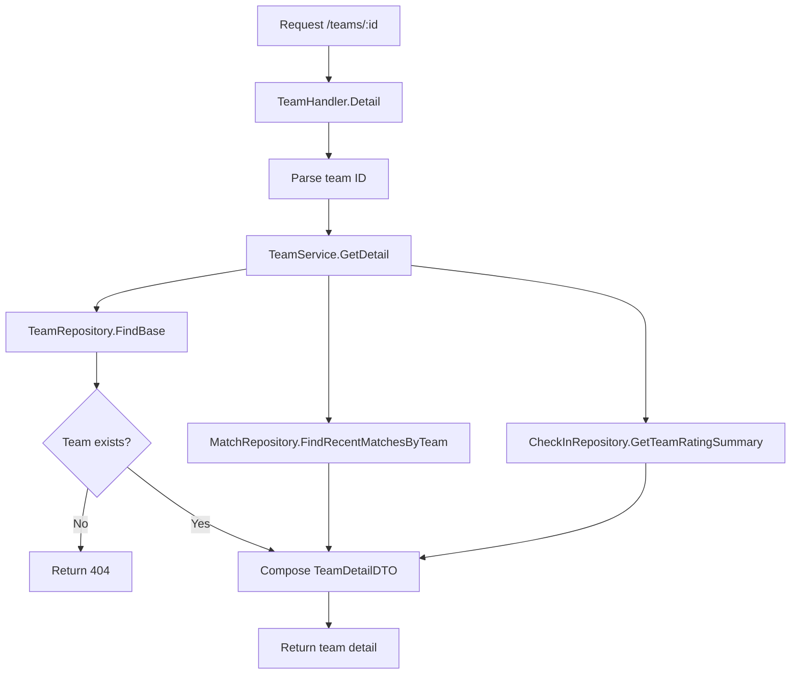
```mermaid
flowchart TD
    A[Request /teams/:id] --> B[TeamHandler.Detail]
    B --> C[Parse team ID]
    C --> D[TeamService.GetDetail]
    D --> E[TeamRepository.FindBase]
    D --> F[MatchRepository.FindRecentMatchesByTeam]
    D --> G[CheckInRepository.GetTeamRatingSummary]
    E --> H{Team exists?}
    H -- No --> I[Return 404]
    H -- Yes --> J[Compose TeamDetailDTO]
    F --> J
    G --> J
    J --> K[Return team detail]
```

## 前后端交互图

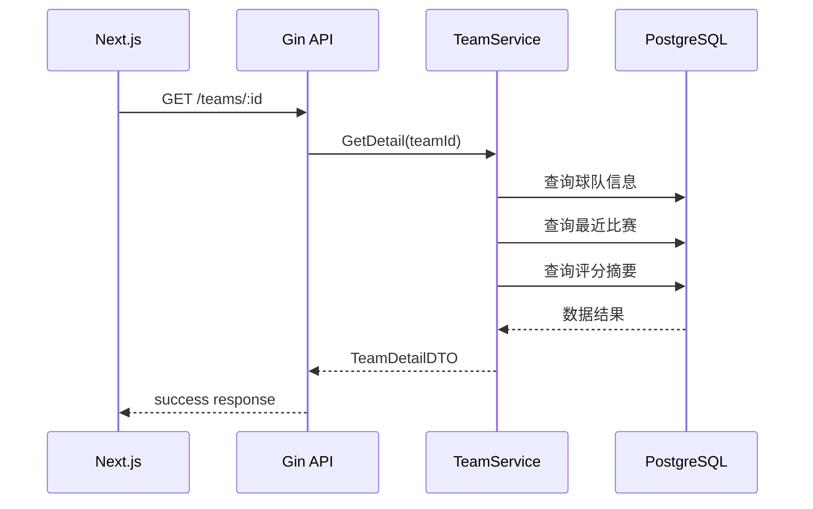
```mermaid
sequenceDiagram
    participant FE as Next.js
    participant API as Gin API
    participant S as TeamService
    participant DB as PostgreSQL

    FE->>API: GET /teams/:id
    API->>S: GetDetail(teamId)
    S->>DB: 查询球队信息
    S->>DB: 查询最近比赛
    S->>DB: 查询评分摘要
    DB-->>S: 数据结果
    S-->>API: TeamDetailDTO
    API-->>FE: success response
```

---

# 10.9 GET /players/:id

## 目标
获取球员详情页数据。

## 返回内容
- 球员基本信息
- 最近被评分比赛
- 平均评分摘要

## 接口流程图

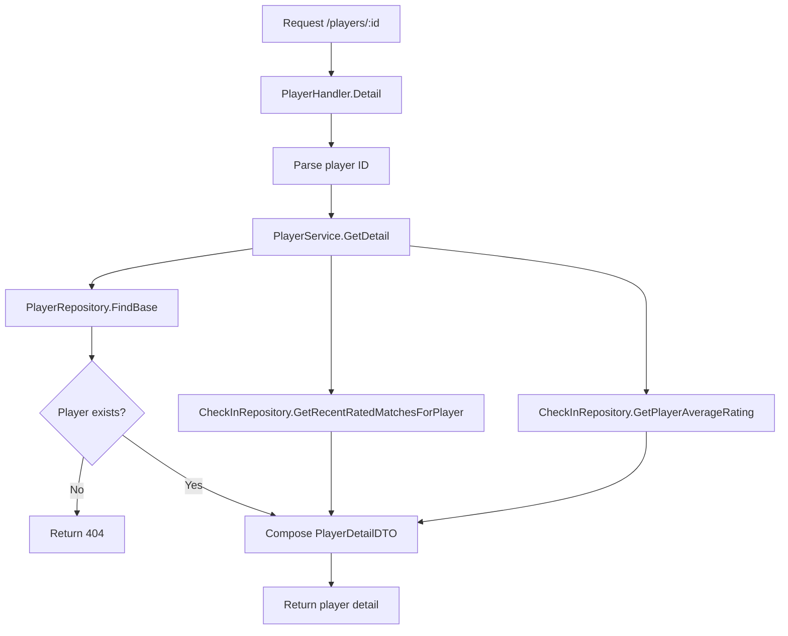
```mermaid
flowchart TD
    A[Request /players/:id] --> B[PlayerHandler.Detail]
    B --> C[Parse player ID]
    C --> D[PlayerService.GetDetail]
    D --> E[PlayerRepository.FindBase]
    D --> F[CheckInRepository.GetRecentRatedMatchesForPlayer]
    D --> G[CheckInRepository.GetPlayerAverageRating]
    E --> H{Player exists?}
    H -- No --> I[Return 404]
    H -- Yes --> J[Compose PlayerDetailDTO]
    F --> J
    G --> J
    J --> K[Return player detail]
```

## 前后端交互图

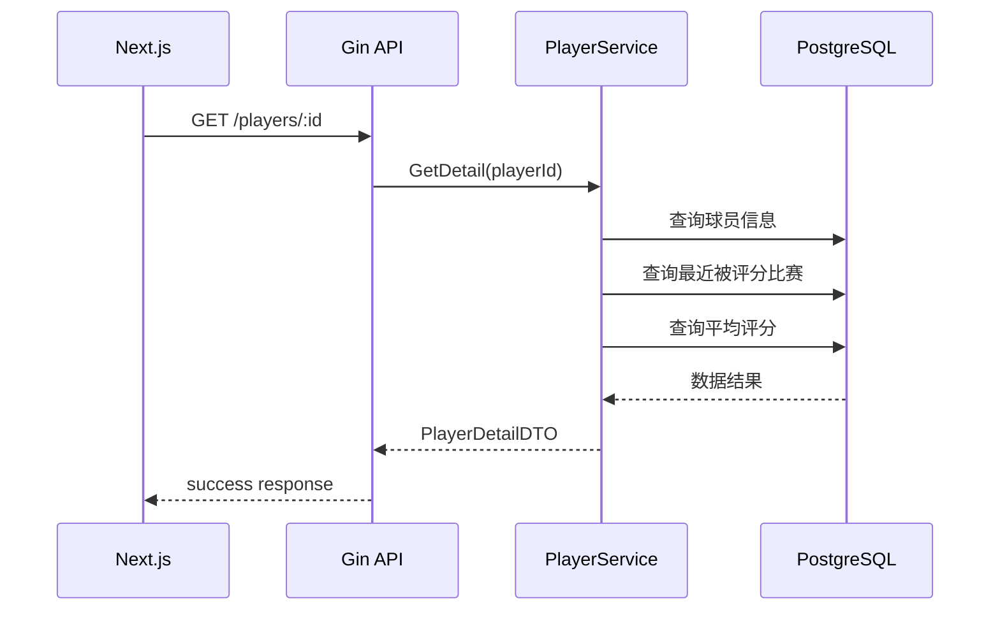
```mermaid
sequenceDiagram
    participant FE as Next.js
    participant API as Gin API
    participant S as PlayerService
    participant DB as PostgreSQL

    FE->>API: GET /players/:id
    API->>S: GetDetail(playerId)
    S->>DB: 查询球员信息
    S->>DB: 查询最近被评分比赛
    S->>DB: 查询平均评分
    DB-->>S: 数据结果
    S-->>API: PlayerDetailDTO
    API-->>FE: success response
```

---

# 10.10 GET /me/profile

## 目标
获取当前用户个人主页摘要数据。

## 返回内容
- 用户基本信息
- 总打卡数
- 平均比赛评分
- 最近打卡
- 最近短评
- 常打卡球队 / 常评分球员摘要

## 接口流程图

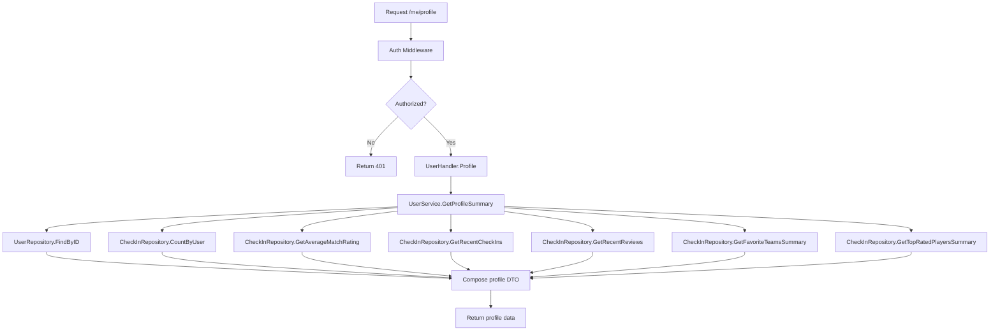
```mermaid
flowchart TD
    A[Request /me/profile] --> B[Auth Middleware]
    B --> C{Authorized?}
    C -- No --> D[Return 401]
    C -- Yes --> E[UserHandler.Profile]
    E --> F[UserService.GetProfileSummary]
    F --> G[UserRepository.FindByID]
    F --> H[CheckInRepository.CountByUser]
    F --> I[CheckInRepository.GetAverageMatchRating]
    F --> J[CheckInRepository.GetRecentCheckIns]
    F --> K[CheckInRepository.GetRecentReviews]
    F --> L[CheckInRepository.GetFavoriteTeamsSummary]
    F --> M[CheckInRepository.GetTopRatedPlayersSummary]
    G --> N[Compose profile DTO]
    H --> N
    I --> N
    J --> N
    K --> N
    L --> N
    M --> N
    N --> O[Return profile data]
```

## 前后端交互图

```mermaid
sequenceDiagram
    participant U as User
    participant FE as Next.js
    participant API as Gin API
    participant S as UserService
    participant DB as PostgreSQL

    U->>FE: 打开个人主页
    FE->>API: GET /me/profile
    API->>S: GetProfileSummary(userId)
    S->>DB: 查询用户基本信息
    S->>DB: 查询统计
    S->>DB: 查询最近打卡
    S->>DB: 查询最近短评
    S->>DB: 查询球队/球员摘要
    DB-->>S: 聚合结果
    S-->>API: ProfileDTO
    API-->>FE: success response
    FE-->>U: 渲染个人主页
```

---

# 10.11 GET /me/checkins

## 目标
获取当前用户历史打卡列表。

## 接口流程图

```mermaid
flowchart TD
    A[Request /me/checkins] --> B[Auth Middleware]
    B --> C{Authorized?}
    C -- No --> D[Return 401]
    C -- Yes --> E[UserHandler.MyCheckIns]
    E --> F[Parse page params]
    F --> G[UserService.ListUserCheckIns]
    G --> H[CheckInRepository.FindByUser]
    H --> I[Build paginated DTO]
    I --> J[Return check-in list]
```

## 前后端交互图

```mermaid
sequenceDiagram
    participant FE as Next.js
    participant API as Gin API
    participant S as UserService
    participant DB as PostgreSQL

    FE->>API: GET /me/checkins?page=1
    API->>S: ListUserCheckIns(userId, page)
    S->>DB: 查询用户打卡记录
    DB-->>S: 记录列表
    S-->>API: PaginatedCheckInListDTO
    API-->>FE: success response
```

---

## 11. 前端页面到接口的映射关系

### 首页 `/`
- 可选调用 `GET /matches` 获取最近比赛

### 比赛列表页 `/matches`
- `GET /matches`

### 比赛详情页 `/matches/[matchId]`
- `GET /matches/:id`
- 登录后再调用：`GET /matches/:id/my-checkin`

### 提交打卡
- `POST /matches/:id/checkin`
- `PUT /matches/:id/checkin`

### 球队页 `/teams/[teamId]`
- `GET /teams/:id`

### 球员页 `/players/[playerId]`
- `GET /players/:id`

### 个人主页 `/me`
- `GET /auth/me`
- `GET /me/profile`
- `GET /me/checkins`

---

## 12. 鉴权设计

### 12.1 v1 推荐方案
v1 推荐采用：
- Gin 统一处理登录
- 登录成功后返回 **JWT** 或 **HTTP-only Cookie**
- 前端通过请求头或 Cookie 维持登录态

### 12.2 公开接口
- `GET /matches`
- `GET /matches/:id`
- `GET /teams/:id`
- `GET /players/:id`

### 12.3 受保护接口
- `GET /auth/me`
- `GET /matches/:id/my-checkin`
- `POST /matches/:id/checkin`
- `PUT /matches/:id/checkin`
- `GET /me/profile`
- `GET /me/checkins`

### 12.4 鉴权中间件职责
- 解析 token / session
- 校验合法性
- 提取 userId
- 注入 Gin context
- 返回统一 401 错误

---

## 13. 错误处理与事务设计

### 13.1 错误处理
按层分：
- Handler 层：HTTP 参数与请求体错误
- Service 层：业务规则错误
- Repository 层：数据库访问错误

### 13.2 事务场景
以下操作必须放事务：
- 创建打卡
- 更新打卡

因为涉及：
- `check_ins`
- `player_ratings`
- `checkin_tags`

必须保证原子性。

---

## 14. 测试策略

### 14.1 后端单元测试重点
- `CheckInService.CreateCheckIn`
- `CheckInService.UpdateCheckIn`
- `MatchService.GetMatchDetail`
- `UserService.GetProfileSummary`

### 14.2 Handler 测试
使用 `httptest` 覆盖：
- 登录
- 创建打卡
- 更新打卡
- 获取比赛详情
- 获取个人主页

### 14.3 前端 E2E 测试重点
- 登录
- 浏览比赛列表
- 打开比赛详情
- 创建打卡
- 编辑打卡
- 查看个人主页

---

## 15. 开发顺序建议

### Phase 1：后端地基
- Gin 项目初始化
- GORM + PostgreSQL
- migration
- seed data
- 基础模型与 repository

### Phase 2：只读接口
- `GET /matches`
- `GET /matches/:id`
- `GET /teams/:id`
- `GET /players/:id`

### Phase 3：鉴权与写接口
- `POST /auth/login`
- `GET /auth/me`
- `POST /matches/:id/checkin`
- `PUT /matches/:id/checkin`
- `GET /matches/:id/my-checkin`

### Phase 4：用户模块
- `GET /me/profile`
- `GET /me/checkins`

### Phase 5：前端接入与打磨
- 页面串联
- 表单体验
- loading / empty / error 状态
- e2e 测试
- 部署

---

## 16. 一句话总结

**Final Whistle v1 采用 Next.js 前端 + Go Gin 后端 + PostgreSQL 数据库的分层架构，以 CheckIn 作为核心业务聚合根，通过明确的 REST API 契约支撑“登录、浏览比赛、打卡评分、查看聚合与个人档案”这一完整主流程，并保证架构足够清晰、可维护、适合 AI Coding 协作。**
