# Final Whistle 主开发文档（Go + Gin）

## 1. 文档定位

本文档是 Final Whistle v1 的主开发文档，用于统一产品边界、技术决策、数据模型、接口契约、关键流程和开发顺序。

它基于以下文档收口而成：

- PRD
- 旧版技术方案
- review 结论
- v1 spec

目标是让前端、后端和 AI Coding 协作时都以同一份文档为准，减少“文档存在但无法直接落地”的情况。

---

## 2. v1 范围

v1 只完成这一条闭环：

`登录 -> 浏览比赛 -> 进入比赛详情 -> 创建/编辑 CheckIn -> 查看聚合 -> 查看个人档案`

v1 不包含：

- 实时比分
- 第三方足球数据同步
- 点赞、回复、评论楼中楼
- 用户自定义标签
- 社交关系
- 长文社区
- 复杂后台

---

## 3. 关键技术决策

### 3.1 认证方案

v1 明确采用：

- `HTTP-only Cookie Session`
- `dev login`

说明：

- 不在 v1 同时维护 `JWT` 和 `Cookie` 两套方案
- GitHub OAuth 延后到 v1.1

### 3.2 数据来源

v1 仅使用内部 seed data。

说明：

- 比赛、球队、球员、标签均来自本地 seed
- 不做数据同步任务
- 不接第三方足球 API

### 3.3 前后端职责

- Next.js 负责页面、UI、表单、状态和 API 调用
- Gin 负责鉴权、业务规则、数据持久化和聚合查询

说明：

- v1 不使用 Next.js Server Action 处理业务写入

### 3.4 聚合策略

- 所有聚合实时查询
- 不做缓存
- 不做异步聚合
- 不做预计算统计表

### 3.5 评分规则

- 全部评分范围固定为 `1-10` 整数
- 球员评分最多 `5` 人
- 平均分保留 `1` 位小数
- 样本数 `< 3` 时前端显示“样本较少”

---

## 4. 技术栈

### 4.1 前端

- Next.js 15
- TypeScript
- App Router
- Tailwind CSS
- shadcn/ui
- React Hook Form
- Zod

### 4.2 后端

- Go
- Gin
- GORM
- go-playground/validator

### 4.3 数据库

- PostgreSQL

### 4.4 测试

- Frontend: Vitest, Playwright
- Backend: go test, httptest

---

## 5. 系统架构

### 5.1 总体架构

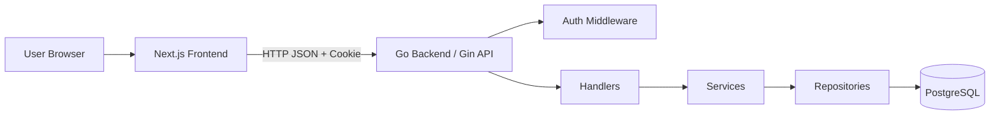

### 5.2 职责边界

前端职责：

- 页面路由
- 页面渲染
- 表单交互
- API 调用
- 登录态展示
- loading / empty / error / unauthorized 状态处理

后端职责：

- Cookie Session 鉴权
- 参数校验
- 业务规则校验
- 事务控制
- 数据持久化
- 聚合查询
- 统一错误返回

---

## 6. 模块拆解

### 6.1 Foundation

- 配置管理
- 数据库连接
- migration
- seed
- router
- 中间件
- 错误处理

### 6.2 Auth

- 登录
- 登出
- 获取当前用户

### 6.3 Match Read

- 比赛列表
- 比赛详情
- 球队详情
- 球员详情

### 6.4 CheckIn Write

- 获取当前用户某场比赛的记录
- 创建记录
- 更新记录

### 6.5 Match Aggregation

- 比赛评分聚合
- 球队评分聚合
- 球员评分排行
- 最近短评

### 6.6 User Profile

- 档案摘要
- 历史记录列表

---

## 7. 数据来源与 Seed 策略

### 7.1 v1 数据来源

仅使用内部 seed data。

建议规模：

- 1 个赛季
- 2 到 4 个赛事
- 20 到 50 场比赛
- 与比赛相关的球队、球员、match_players
- 固定标签字典

### 7.2 扩展预留

如需为未来外部数据源做准备，可预留：

- `external_source`
- `external_id`

但 v1 不实现同步逻辑。

---

## 8. 核心实体与 Schema 原则

### 8.1 核心实体

- User
- Team
- Player
- Match
- MatchPlayer
- CheckIn
- PlayerRating
- Tag
- CheckInTag
- Session

### 8.2 建模原则

#### 1. CheckIn 是聚合根

CheckIn 承载：

- watchedType
- supporterSide
- matchRating
- homeTeamRating
- awayTeamRating
- shortReview
- watchedAt

球员评分和标签通过关联表挂载在 CheckIn 下。

#### 2. 一名用户对一场比赛只允许一条主记录

唯一索引：

- `(user_id, match_id)`

#### 3. 尽量结构化，不滥用 JSON

评分、标签、观看方式等字段应显式建模。

#### 4. 聚合实时计算

比赛详情页和个人主页涉及的汇总信息在查询时实时计算。

---

## 9. 核心字段设计

### 9.1 User

- `id`
- `name`
- `email`
- `avatar_url`
- `created_at`
- `updated_at`

### 9.2 Team

- `id`
- `name`
- `short_name`
- `slug`
- `logo_url`
- `created_at`
- `updated_at`

### 9.3 Player

- `id`
- `team_id`
- `name`
- `slug`
- `position`
- `avatar_url`
- `created_at`
- `updated_at`

### 9.4 Match

- `id`
- `competition`
- `season`
- `round`
- `status`
- `kickoff_at`
- `home_team_id`
- `away_team_id`
- `home_score`
- `away_score`
- `venue`
- `created_at`
- `updated_at`

### 9.5 MatchPlayer

- `id`
- `match_id`
- `player_id`
- `team_id`

用途：

- 校验用户评分球员是否属于该场比赛

### 9.6 Tag

- `id`
- `name`
- `slug`
- `sort_order`
- `is_active`

### 9.7 CheckIn

- `id`
- `user_id`
- `match_id`
- `watched_type`
- `supporter_side`
- `match_rating`
- `home_team_rating`
- `away_team_rating`
- `short_review`
- `watched_at`
- `created_at`
- `updated_at`

约束：

- 唯一索引：`(user_id, match_id)`
- `short_review` 最大 280 字

### 9.8 PlayerRating

- `id`
- `check_in_id`
- `player_id`
- `rating`
- `note`

约束：

- 单条 CheckIn 最多 5 条
- `note` 最大 80 字

### 9.9 CheckInTag

- `id`
- `check_in_id`
- `tag_id`

### 9.10 Session

- `id`
- `user_id`
- `token`
- `expired_at`
- `created_at`

---

## 10. 枚举与业务规则

### 10.1 watched_type

- `FULL`
- `PARTIAL`
- `HIGHLIGHTS`

### 10.2 supporter_side

- `HOME`
- `AWAY`
- `NEUTRAL`

### 10.3 match.status

- `SCHEDULED`
- `FINISHED`

v1 仅允许对 `FINISHED` 的比赛创建或编辑 CheckIn。

### 10.4 评分规则

- `matchRating`: 1-10
- `homeTeamRating`: 1-10
- `awayTeamRating`: 1-10
- `playerRatings[].rating`: 1-10

### 10.5 球员评分规则

- 可选，不是必填
- 最多选择 5 名球员
- 球员必须属于当前比赛

### 10.6 标签规则

- 标签来自固定字典
- 只允许选择启用中的标签
- v1 不支持用户创建标签

### 10.7 文本规则

- `shortReview` 可选，最大 280 字
- `playerRatings[].note` 可选，最大 80 字

### 10.8 聚合规则

- 聚合基于当前所有有效 CheckIn
- 平均分保留 1 位小数
- 样本数少于 3 时前端显示“样本较少”
- 无数据时返回 `null` 或空数组

---

## 11. 目录结构建议

### 11.1 前端

```txt
frontend/
  src/
    app/
      page.tsx
      login/
        page.tsx
      matches/
        page.tsx
        [matchId]/
          page.tsx
      teams/
        [teamId]/
          page.tsx
      players/
        [playerId]/
          page.tsx
      me/
        page.tsx

    components/
      ui/
      layout/
      auth/
      matches/
      checkins/
      profile/
      teams/
      players/

    lib/
      api/
        client.ts
        auth.ts
        matches.ts
        checkins.ts
        teams.ts
        players.ts
        users.ts
      validations/
      utils/

    types/
      api.ts
      domain.ts
```

### 11.2 后端

```txt
backend/
  cmd/
    api/
      main.go

  internal/
    config/
    db/
    middleware/
    router/

    handler/
      auth_handler.go
      match_handler.go
      checkin_handler.go
      team_handler.go
      player_handler.go
      user_handler.go

    service/
      auth_service.go
      match_service.go
      checkin_service.go
      team_service.go
      player_service.go
      user_service.go

    repository/
      user_repository.go
      match_repository.go
      checkin_repository.go
      team_repository.go
      player_repository.go
      tag_repository.go
      session_repository.go

    dto/
      auth_dto.go
      match_dto.go
      checkin_dto.go
      team_dto.go
      player_dto.go
      user_dto.go
      common_dto.go

    model/
      user.go
      team.go
      player.go
      match.go
      match_player.go
      checkin.go
      player_rating.go
      tag.go
      checkin_tag.go
      session.go

    utils/

  migrations/
  seed/
  go.mod
```

---

## 12. API 总览

### 12.1 Auth

- `POST /auth/login`
- `POST /auth/logout`
- `GET /auth/me`

### 12.2 Match

- `GET /matches`
- `GET /matches/:id`

### 12.3 CheckIn

- `GET /matches/:id/my-checkin`
- `POST /matches/:id/checkin`
- `PUT /matches/:id/checkin`

### 12.4 Team / Player

- `GET /teams/:id`
- `GET /players/:id`

### 12.5 User

- `GET /me/profile`
- `GET /me/checkins`

---

## 13. 统一 API 约定

### 13.1 成功返回格式

```json
{
  "success": true,
  "data": {}
}
```

### 13.2 错误返回格式

```json
{
  "success": false,
  "error": {
    "code": "VALIDATION_ERROR",
    "message": "invalid request body",
    "details": {}
  }
}
```

### 13.3 错误码

- `UNAUTHORIZED`
- `FORBIDDEN`
- `NOT_FOUND`
- `VALIDATION_ERROR`
- `CONFLICT`
- `INTERNAL_ERROR`

### 13.4 分页规范

列表接口统一返回：

- `items`
- `page`
- `pageSize`
- `total`

默认值：

- `page=1`
- `pageSize=20`
- 最大 `pageSize=50`

### 13.5 命名规范

- API DTO：`camelCase`
- 数据库表与字段：`snake_case`
- 枚举值：全大写

---

## 14. 关键接口设计与流程图

### 14.1 `POST /auth/login`

目标：

- 使用 `dev login` 建立会话

请求体示例：

```json
{
  "email": "demo@example.com",
  "name": "Demo User"
}
```

返回：

- 当前用户信息
- 通过 HTTP-only Cookie 写入会话标识

接口流程图：

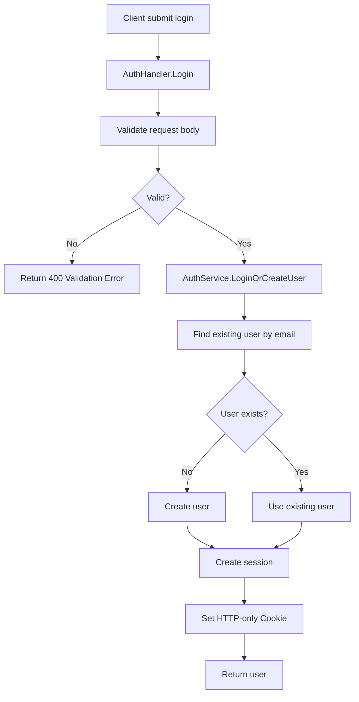

前后端交互图：

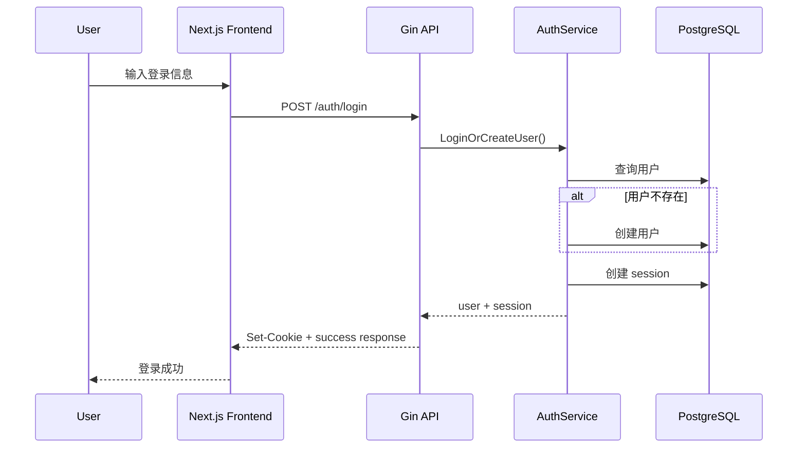

### 14.2 `GET /auth/me`

目标：

- 获取当前登录用户信息

接口流程图：

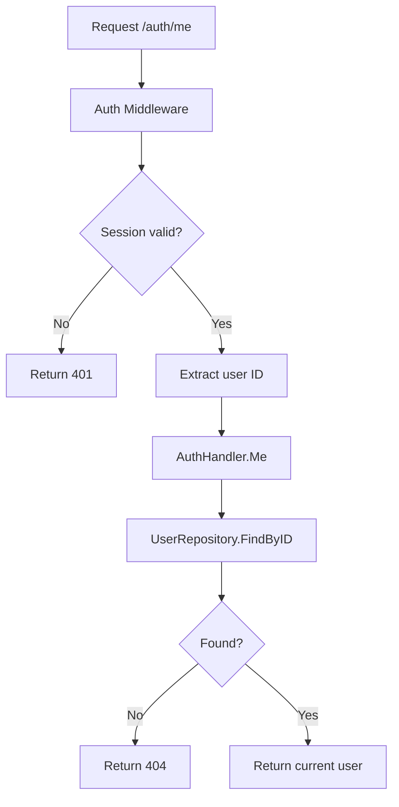

### 14.3 `GET /matches`

查询参数：

- `competition`
- `season`
- `page`
- `pageSize`

接口流程图：

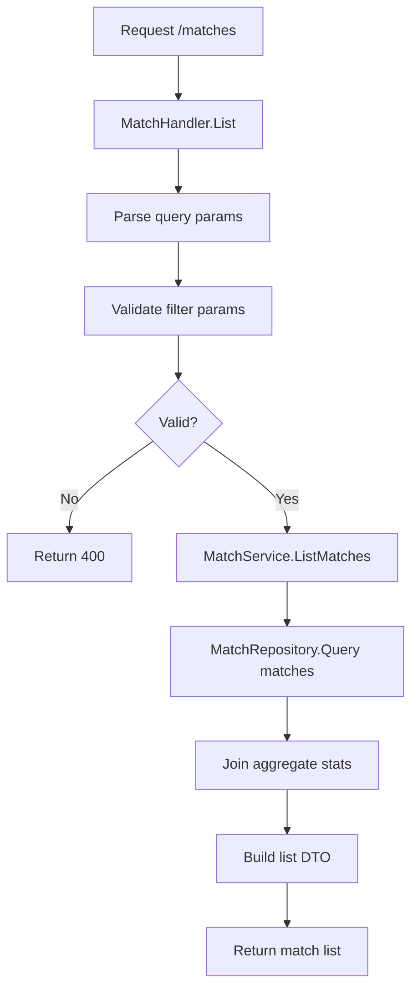

### 14.4 `GET /matches/:id`

返回：

- 比赛基础信息
- 平均比赛评分
- 平均主队评分
- 平均客队评分
- 球员评分排行
- 最近短评
- 打卡人数

接口流程图：

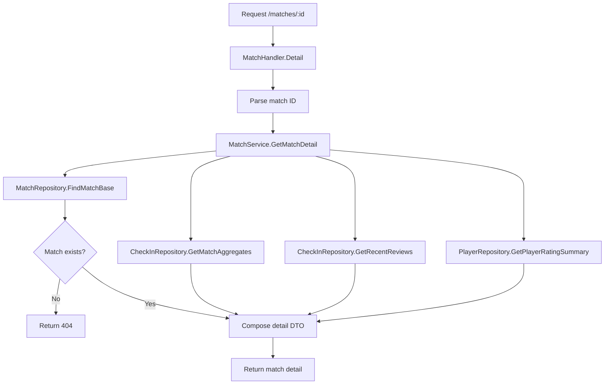

前后端交互图：

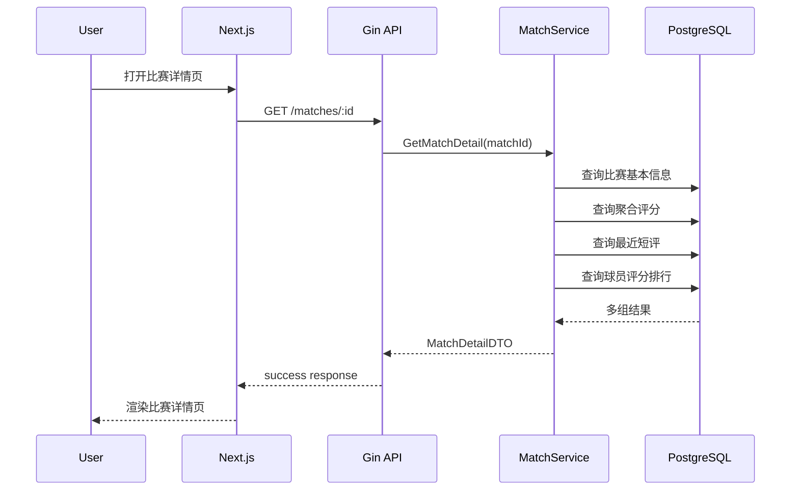

### 14.5 `GET /matches/:id/my-checkin`

目标：

- 获取当前用户对某场比赛的已有记录

接口流程图：

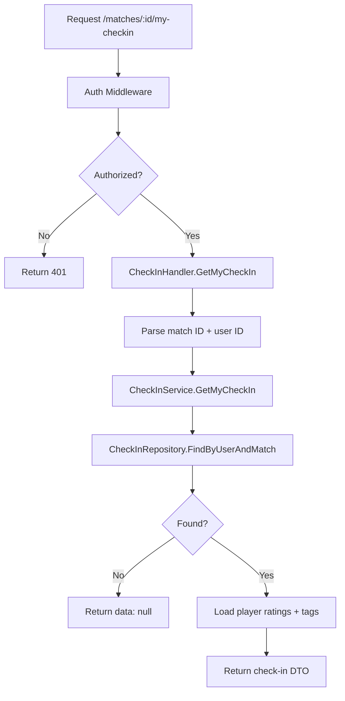

### 14.6 `POST /matches/:id/checkin`

目标：

- 创建当前用户对某场比赛的记录

请求体示例：

```json
{
  "watchedType": "FULL",
  "supporterSide": "HOME",
  "matchRating": 8,
  "homeTeamRating": 9,
  "awayTeamRating": 6,
  "shortReview": "A tense and unforgettable match.",
  "watchedAt": "2026-03-24T20:00:00Z",
  "tags": [1, 4],
  "playerRatings": [
    {
      "playerId": 101,
      "rating": 9,
      "note": "Best player on the pitch"
    }
  ]
}
```

校验：

- 比赛存在
- 比赛状态为 `FINISHED`
- 用户尚未创建记录
- 球员属于该比赛
- 标签合法

接口流程图：

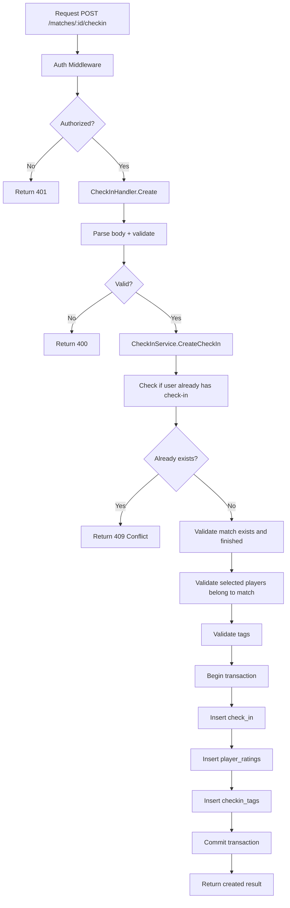

前后端交互图：

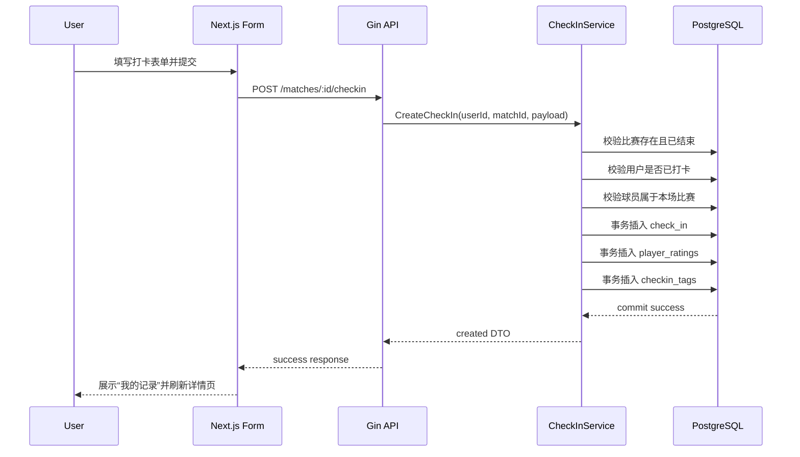

### 14.7 `PUT /matches/:id/checkin`

目标：

- 更新当前用户对某场比赛的记录

接口流程图：

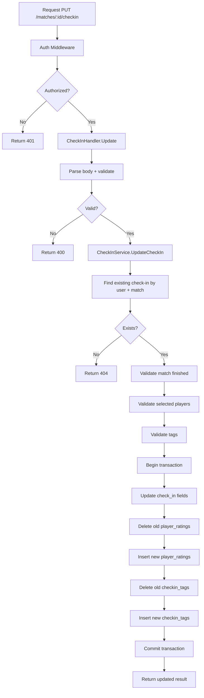

### 14.8 `GET /teams/:id`

返回：

- 球队基础信息
- 最近比赛
- 平均评分摘要

### 14.9 `GET /players/:id`

返回：

- 球员基础信息
- 最近被评分比赛
- 平均评分摘要

### 14.10 `GET /me/profile`

返回：

- 用户基础信息
- 总打卡数
- 平均比赛评分
- 最近打卡
- 最近短评
- 常打卡球队前 3
- 常评分球员前 3

接口流程图：

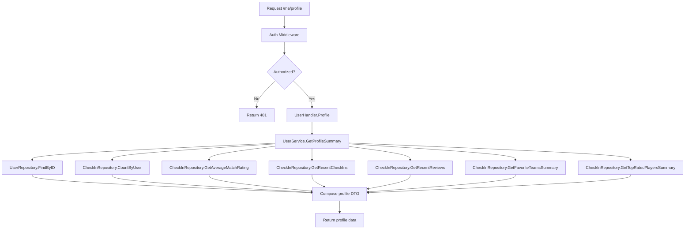

前后端交互图：

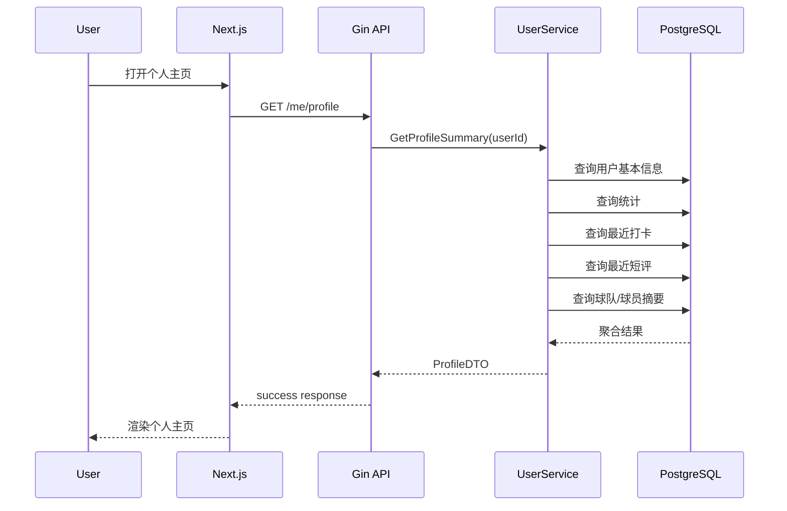

### 14.11 `GET /me/checkins`

目标：

- 获取当前用户历史记录列表

接口流程图：

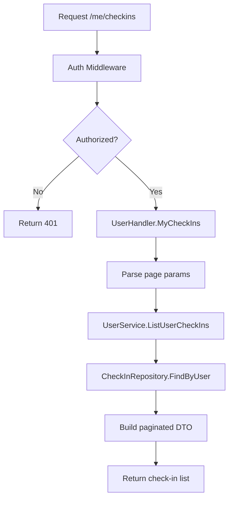

---

## 15. 前端页面到接口映射

### `/matches`

- `GET /matches`

### `/matches/[matchId]`

- `GET /matches/:id`
- 登录后调用 `GET /matches/:id/my-checkin`

### 打卡表单

- `POST /matches/:id/checkin`
- `PUT /matches/:id/checkin`

### `/teams/[teamId]`

- `GET /teams/:id`

### `/players/[playerId]`

- `GET /players/:id`

### `/me`

- `GET /auth/me`
- `GET /me/profile`
- `GET /me/checkins`

---

## 16. 鉴权设计

### 16.1 v1 方案

采用 Cookie Session。

服务端职责：

- 创建 session 记录
- 通过 HTTP-only Cookie 下发 session 标识
- 在中间件中解析并校验 session

前端职责：

- 使用 `credentials: include` 发起请求
- 通过 `/auth/me` 恢复登录态

### 16.2 公开接口

- `GET /matches`
- `GET /matches/:id`
- `GET /teams/:id`
- `GET /players/:id`

### 16.3 受保护接口

- `POST /auth/logout`
- `GET /auth/me`
- `GET /matches/:id/my-checkin`
- `POST /matches/:id/checkin`
- `PUT /matches/:id/checkin`
- `GET /me/profile`
- `GET /me/checkins`

---

## 17. 事务与错误处理

### 17.1 必须使用事务的场景

- 创建 CheckIn
- 更新 CheckIn

涉及表：

- `check_ins`
- `player_ratings`
- `checkin_tags`

### 17.2 错误分层

- Handler：参数错误、请求体错误
- Service：业务规则错误
- Repository：数据库访问错误

### 17.3 推荐业务错误

- 重复创建记录：`CONFLICT`
- 比赛未结束：`VALIDATION_ERROR`
- 球员不属于比赛：`VALIDATION_ERROR`
- 登录态无效：`UNAUTHORIZED`

---

## 18. 测试策略

### 18.1 后端重点

- `AuthService.Login`
- `CheckInService.CreateCheckIn`
- `CheckInService.UpdateCheckIn`
- `MatchService.GetMatchDetail`
- `UserService.GetProfileSummary`

### 18.2 Handler 测试

覆盖：

- 登录
- 登出
- 获取当前用户
- 创建打卡
- 更新打卡
- 获取比赛详情
- 获取个人主页

### 18.3 前端 E2E

覆盖主路径：

1. 登录
2. 浏览比赛列表
3. 打开比赛详情
4. 创建 CheckIn
5. 编辑 CheckIn
6. 打开个人主页

---

## 19. 开发顺序建议

### Phase 1

- Foundation
- migration
- seed
- 基础模型

### Phase 2

- `GET /matches`
- `GET /matches/:id`
- `GET /teams/:id`
- `GET /players/:id`

### Phase 3

- `POST /auth/login`
- `POST /auth/logout`
- `GET /auth/me`
- `GET /matches/:id/my-checkin`
- `POST /matches/:id/checkin`
- `PUT /matches/:id/checkin`

### Phase 4

- `GET /me/profile`
- `GET /me/checkins`

### Phase 5

- 前端串联
- loading / empty / error 完善
- E2E
- 部署

---

## 20. 完成定义

满足以下条件即视为 v1 落地完成：

1. 前后端工程可启动
2. seed data 可导入
3. 用户可登录并维持会话
4. 用户可浏览比赛并查看详情
5. 用户可创建和编辑唯一一条 CheckIn
6. 比赛详情页可展示聚合与短评
7. 个人主页可展示档案摘要与历史记录
8. 核心路径测试通过

---

## 21. 后续扩展点

以下能力延后到 v1.1 或更后版本：

- GitHub OAuth
- 外部足球数据同步
- 年度观赛报告
- 更丰富的统计页
- 社区互动
- AI 赛后卡片

---

## 22. 分析报告处理结论

本文档已吸收《技术方案分析报告》中的有效建议，但不原样全收。处理原则如下：

### 22.1 直接采纳

- 为 `matches(kickoff_at)` 添加索引
- 为 `check_ins(created_at)` 添加索引
- 为 `player_ratings(player_id)` 添加索引
- Session 使用数据库存储
- 合同先行开发
- 健康检查接口
- 多环境配置
- 结构化日志

### 22.2 修改后采纳

- 为未来数据源扩展预留 `external_source` / `external_id`
  - 仅加在 `matches`、`teams`、`players`
- Cookie 安全配置
  - `production` 开启 `Secure`
  - 所有环境启用 `HttpOnly`
  - `SameSite` 按部署场景配置
- 会话失效错误
  - v1 可统一映射到 `UNAUTHORIZED`
  - 如后续有明确前端处理差异，再细分 `INVALID_SESSION`

### 22.3 延后

- 所有核心表软删除 `deleted_at`
- 限流错误码 `RATE_LIMIT_EXCEEDED`
- 服务不可用错误码 `SERVICE_UNAVAILABLE`
- Redis 缓存
- 物化视图
- 定时刷新聚合
- 乐观锁版本控制
- 完整错误追踪平台
- 为未来 JWT 切换做额外抽象

### 22.4 不直接接受的建议

- “仅 `match_rating` 必填” 不直接采用

说明：

- 必填字段必须以 spec 和 DTO 为准，不能在分析意见中临时修改业务规则

---

## 23. 分页规则

### 23.1 需要分页的接口

- `GET /matches`
- `GET /me/checkins`

### 23.2 不分页的接口

- `GET /matches/:id`
- `GET /matches/:id/my-checkin`
- `GET /teams/:id`
- `GET /players/:id`
- `GET /me/profile`

### 23.3 详情页内嵌列表策略

以下内容在 v1 先采用“限量返回”，不单独拆分页接口：

- 比赛详情页最近短评：返回最近 `5-10` 条
- 比赛详情页球员评分排行：返回前 `5-10` 名
- 个人主页最近记录：返回最近若干条
- 个人主页最近短评：返回最近若干条

### 23.4 分页响应结构

v1 统一采用简单结构：

```json
{
  "success": true,
  "data": {
    "items": [],
    "page": 1,
    "pageSize": 20,
    "total": 100
  }
}
```

默认值：

- `page=1`
- `pageSize=20`
- 最大 `pageSize=50`
